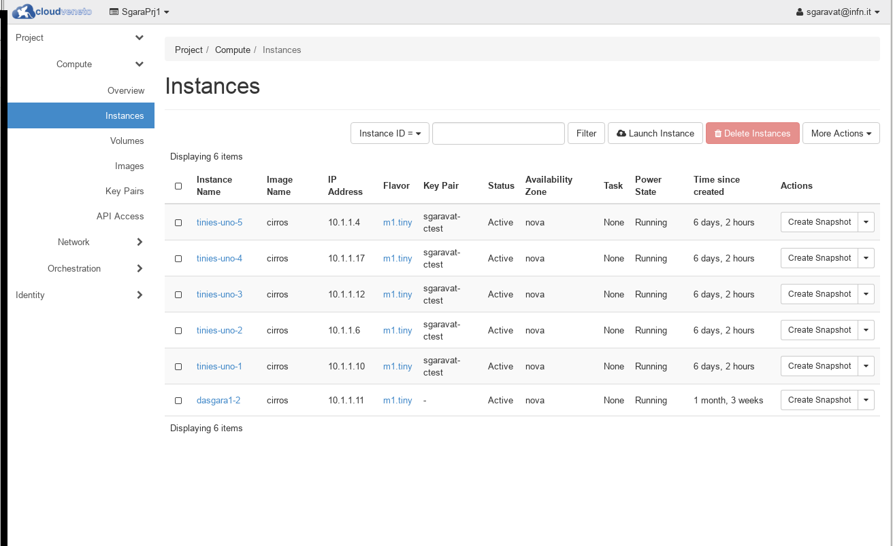
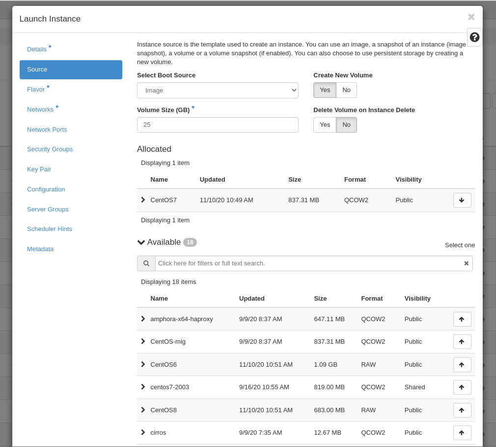
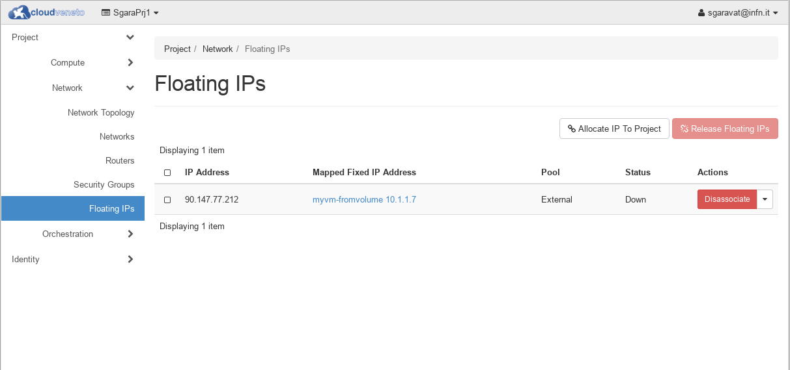
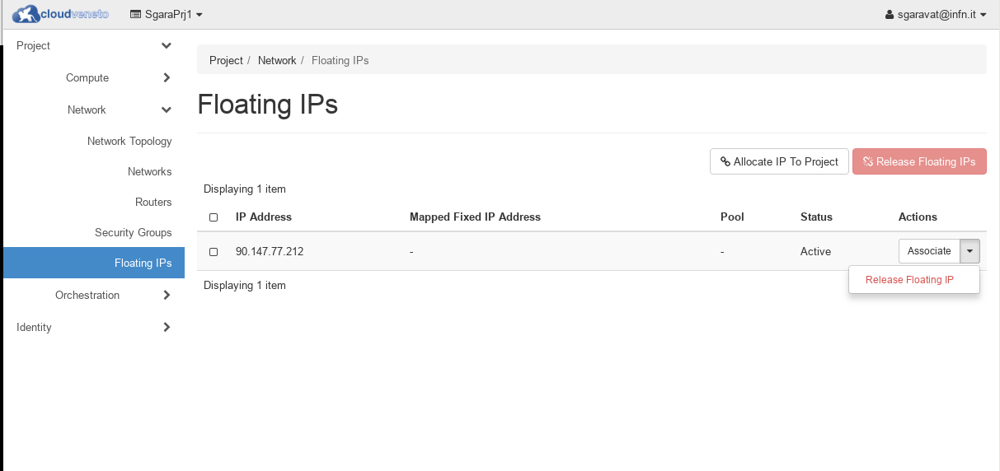
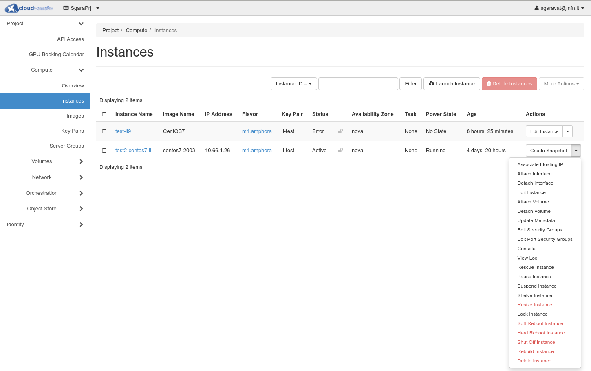

..    include:: <isonum.txt>

Managing Virtual Machines
=========================
.. IMPORTANT ::

    Virtual machines, even if idle or in shutdown state, allocate resources which therefore aren't
    available to other users.
    Therefore please delete the virtual instances that you don't plan to use anymore in the near future.
    
    Cloud administrators perform regular campaigns to identify and possibly delete unused instances.  

Creating Virtual Machines
-------------------------
.. _creatingvms:

To create a Virtual Machine (VM) you need to have first:

- created your private key (as
  explained in :ref:`Creating a keypair<CreatingAKeypair>`) 
- set the security group(s) (as discussed in :ref:`Setting security group(s)<SecurityGroups>`) to be
  used for this VM.

To create a VM using the dashboard proceed as follows:

-  Be sure you have selected the right Project from the dropdown menu on
   the top.

-  Go to **Compute** |rarr| **Instances** on the left hand menu. This will display a
   list of VMs currently running in your project.

-  Select the **Launch Instance** button. A new window appears. 

   .. image:: ./images/launchinstance-xena.png
      :align: center

In the **Details** tab enter:

   -  **Instance name** is the name of the machine you want to create.
   -  **Count** is the number of virtual machines to be started.

Switch to the **Source** tab:

   .. image:: ./images/launchinstance-source-xena.png
      :align: center

   -  Unless you want to start a VM from a volume (see 
      :ref:`Improve reliability: creating Virtual Machines from Volumes<BootFromVolume>`), 
      as **Select Boot Source** select **Image** or **Instance
      Snapshot** and then select the one to be used.

Switch to the **Flavor** tab:

   .. image:: ./images/launchinstance-flavor-xena.png
      :align: center

   -  Select the desidered flavor. The flavor is the size of the machine you want to create. This is
      specified using VCPUs (number of virtual CPUs), disk space for the
      system disk, size for the RAM memory. It is recommended to possibly use 
      small flavors (the flavor of a virtual machine can be changed later if
      required). Flavors are discussed in :ref:`Flavors<Flavors>`.

Switch to the **Networks** tab:

   .. image:: ./images/launchinstance-network-xena.png
      :align: center

   You should see at least one network called *<ProjectName>-lan*. Select that one.

    .. NOTE ::
   
       INFN users could see, besides the *<ProjectName>-lan* network, also
       a network called *<ProjectName>-wan*, if the possibility to use
       public IP numbers was requested. The former one must be selected
       if the VM doesn't need to be visible on the Internet. The
       *<ProjectName>-wan* network must be selected if instead the VM must
       have a public IP. It will then be necessary to allocate a public
       (floating) IP address to this instance, as explained in :ref:`Giving a VM public access (getting a floating IP)<PublicAccess>`.

Switch to the **Security Groups** tab:

   .. image:: ./images/launchinstance-secgroups-xena.png
      :align: center

   -  Select the security group(s) to be used for this VM (security groups
      are discussed in :ref:`Setting security group(s)<SecurityGroups>`).

Switch to the **Key Pair** tab:

   .. image:: ./images/launchinstance-keypair-xena.png
      :align: center

   -  Select the keypair you want to use. This will allow you to
      log to the VM (usually as root or as an account where you can get
      admin privileges via sudo) using this SSH key.

   -  You can also specify the admin (usually root) password of the
      instance, enabling the **Set admin password** box.

      .. WARNING ::
 
          Please note that setting the admin password is not guaranteed
          to always work (the image can't support the “injection” of
          this password). It is therefore strongly suggested to rely on
          the ssh-key mechanisms.

Select **Launch Instance** to start the virtual machine being created. You will be
returned to the Overview screen, where there will be a line with the
instance name, ip adress and status. The status should be 'Active'
once the install is complete.

Once the status of the machine is 'Active', you can watch the console to
see it installing and booting. You can click on the VM name and go to a
dedicated window or from this same table you can access a pull down menu
on the right hand side under **Actions**. There you will see various options
and among them **View Log** and **Console**. 

.. image:: ./images/instance-more.png
   :align: center

For a Linux machine, select **Console**
to access to the console of the VM.

Improve reliability: creating Virtual Machines from Volumes
^^^^^^^^^^^^^^^^^^^^^^^^^^^^^^^^^^^^^^^^^^^^^^^^^^^^^^^^^^^
.. _BootFromVolume:

By default Virtual Machines are instantiated using the local disk of the
Cloud compute node. This means that, in case of failure of the compute
node, it may happen that the virtual machine content is lost.

For production servers which are not fully redundant,
to improve the availability it is advisable to use external storage
(i.e. a volume) for the system disk of the virtual machine. The advantage is also
that, if the compute node hosting the virtual machine has to be switched
off e.g. for maintenance, the Cloud administrator before doing this
operation can live-migrate the instance to another Cloud compute node
basically without any service interruption.

On the other hand, I/O performance is usually better when the instance
is created using the local disk of the compute node with respect to a
virtual machine created from volume.

To create a VM from volume, proceed as explained in 
:ref:`Creating Virtual Machines<creatingvms>`, but in the **Source** tab please:

* specify 'Yes' for **Create New Volume**
* specify 'No' for **Delete Volume on Instance Delete**
* specify the desired volume size

Accessing Virtual Machines: the big picture
-------------------------------------------

Once your VM is in the "running" state you access it through ssh with a default
username (more on that later) and your private key. 

There are three possible scenarios:

-  You are a INFN user, so you might have access to the internal INFN network:
   from there you can contact directly your VM on a network like 10.64.x.y;

-  You don't have such access or you are connecting from outside such network: you 
   must access a "gate" machine first and then access the VM;

-  You need to perform that "one shot operation" or you want to check the state
   of your VM: you can use the "Console" tab of your VM via web.

.. NOTE ::

    Virtual Machines instantiated on the Cloud by default aren't
    registered in the DNS. This means that you'll have to refer to them
    using their IP numbers.

Logging to a VM
---------------
.. _LoggingToAVM:

Virtual machines created on the cloud have their IP assigned on a
**private** network associated with the project they belong to. Therefore
they cannot be accessed directly from the internet. 

If you need to log on your VMs from the Internet you must go through a
gate machine: **gate.cloudveneto.it**.

When your account on the cloud is created, credentials for accessing such
gate are sent to you. Contact support@cloudveneto.it in case of problems 
with this credentials.

.. NOTE ::

    Projects created (mostly) for INFN users get their private network 
    on a 10.64.x.y address. The VMs on these networks can be accessed 
    directly from the INFN-Padova or INFN-Legnaro Local Area Networks (LANs).

Assuming that

-  You created a Linux virtual machine using the *<ProjectName>-lan*
   network;

-  Your VM got the 10.67.15.3 IP address;

-  You know the default user on the VM

   - For CentOS based instances there is a default user called 'centos';
   - For AlmaLinux  based instances there is a default user called 'almalinux'
   - For Ubuntu based instances there is a default user called 'ubuntu';

-  You stored your *my\_key keypair* in *~/private* on the gate machine;

you can access your VM from the gate machine issuing

::

           ssh -i ~/private/my_key ubuntu@10.67.15.3

Conversely, there is
no limitation on the 'outer' services you can reach from your VM (modulo
the services hosted in the INFN Padova/Legnaro LANs, as described in 
:ref:`Accessing other hosts/services from Virtual Machines<AccessingFromVMs>`).

Common access problems
^^^^^^^^^^^^^^^^^^^^^^

You might receive an error upon logging to a VM. Two of the most common
are:

-  PROBLEM SYMPTOM:

   ::

       @@@@@@@@@@@@@@@@@@@@@@@@@@@@@@@@@@@@@@@@@@@@@@@@@@@@@@@@@@@
       @         WARNING: UNPROTECTED PRIVATE KEY FILE!          @
       @@@@@@@@@@@@@@@@@@@@@@@@@@@@@@@@@@@@@@@@@@@@@@@@@@@@@@@@@@@
       Permissions 0644 for '/home/user/my_key.pem' are too open.
       It is required that your private key files are NOT accessible by others.
       This private key will be ignored.
       Load key "/home/user/my_key.pem": bad permissions
       ubuntu@10.64.14.12: Permission denied (publickey).

-  SOLUTION: you forgot to change the permission on your private key
   (see :ref:`Creating a keypair<CreatingAKeypair>`). Please run:

   ::

       chmod 600 /home/user/my_key.pem

   and try again.

-  PROBLEM SYMPTOM:

   ::

       @@@@@@@@@@@@@@@@@@@@@@@@@@@@@@@@@@@@@@@@@@@@@@@@@@@@@@@@@@@
       @    WARNING: REMOTE HOST IDENTIFICATION HAS CHANGED!     @
       @@@@@@@@@@@@@@@@@@@@@@@@@@@@@@@@@@@@@@@@@@@@@@@@@@@@@@@@@@@
       IT IS POSSIBLE THAT SOMEONE IS DOING SOMETHING NASTY!
       Someone could be eavesdropping on you right now (man-in-the-middle attack)!
       It is also possible that the RSA host key has just been changed.
       The fingerprint for the RSA key sent by the remote host is
       c8:1b:1d:37:61:ee:9f:e4:db:5b:31:91:35:7b:d2:59.
       Please contact your system administrator.
       Add correct host key in /home/user/.ssh/known_hosts to get rid of this message.
       Offending key in /home/user/.ssh/known_hosts:3
       RSA host key for 10.64.51.7 has changed and you have requested strict checking.
       Host key verification failed.

-  SOLUTION: the IP of your VM has probably been reused. You need to
   delete the offending entry on your */home/user/.ssh/known\_hosts* file.
   For example you can use:

   ::

       sed -i '/^10.64.51.7 ssh/d' .ssh/known_hosts

   and try again to connect.

Access a service running on the VM
----------------------------------

Your VM might be running some service (e.g. an http server) you want
to access from the net. Since VMs are on a private network this might be tricky.
A clever approach is to use an **SSH tunnel** (port forwarding mechanism). 
This technique allows you to *transport* a TCP port opened on your VM
directly **on your PC**. TCP port 22 can be used for ssh/scp access but any
port (e.g. 80 or 443 for a web service) will do. This same mechanism can be used
to transport **multiple ports** at once.

* USE CASE 1: Suppose you want to access a web service answering on port 80 of 
  your VM (IP address is 10.X.Y.Z).

  Proceed as follows: 

  -  Choose a free TCP port on your machine in the range 1025-65535 (e.g. 2080);
  
  -  Set up the tunnel using your access to the gate machine of
     the cloud (i.e.. gate.cloudveneto.it) and providing your TCP port of
     choice and the IP address of your remote VM:
  
     ::
  
               ssh -L2080:10.X.Y.Z:80 user@gate.cloudveneto.it
               
  
     The tunnel needs to stay open as long as you need to access the VM.
  
  The syntax is explained in the following picture:
  
  .. image:: ./images/ssh-tunnel.png
     :align: center
  
  -  The green part is **your side** of the connection (e.g. the port opened
     on your PC);
  
  -  user@gate..... is the **transport part** of the connection;
  
  -  10.X.Y.Z:80 in red is the **remote end** of the connection.
  
  The blu arrows depict the data flow.
  
  Once you have opened the tunnel you have, on your machine, a direct
  entry point to your VM (port 2080 in this case).

  From a browser on your local machine, you can now access the web service
  running on the VM at the url

  ::

      http://localhost:2080

* USE CASE 2: you want to access both the web service on port 80 and the ssh service (port 22)
  on your VM. Proceed as follows:
  
  - Choose **two** free TCP port on your machine in the range 1025-65535 (e.g. 2080 and 2022);
  
  - Set up the tunnel using your access the gate machine of the cloud (i.e. gate.cloudveneto.it) 
    and providing your TCP ports of choice and the IP address of your remote VM:
  
  ::
  
     ssh -L2080:10.X.Y.Z:80 -L2022:10.X.Y.Z:22 user@gate.cloudveneto.it
  
  
  The tunnel needs to stay open as long as you need to access the VM.
  
  From **another terminal** of your local machine, you can now:
  
  - access the VM using ssh with the -p (lowercase 'p') parameter:
  
  ::
  
      ssh -p 2022 -i  ~/private/my_key remoteuser@localhost
  
  
  ( e.g.: ssh -p 2022 -i ~/paolo.pem ubuntu@localhost )
  
  - copy a file on the VM using scp with the **-P** (capital 'p') parameter
  
  ::
  
      scp -P 2022 -i ~/private/my_key  my_local_file.txt  remoteuser@localhost:/remote/path/
  
  ( e.g. scp -P 2022 -i ~/paolo.pem my_local_file.txt ubuntu@localhost:/tmp/ )
  
  - from **your web browser** you can access the web service on the VM by accessing the url
  
  ::
  
      http://localhost:2080
  
  
  If `sshfs <https://github.com/libfuse/sshfs>`__ is installed, you can
  use it with the tunnel with the following command
  
  ::
  
      sshfs -p 2022 remoteuser@localhost:/remote/path /local/path -o IdentityFile=~/private/my_key
  
  It is a file system client that mounts the remote file system locally.
  
  .. NOTE ::
  
  
      Tip: if the last part of your VM IP is Z, choosing 2000+Z as
      the local TCP port is a good way to memorize the (local port |rarr| remote
      VM) association of your tunnel.
  
Copying files to a VM
---------------------

Copying files to your VM might be a little more complex since VMs don't
have an access facing the internet. Your options are:

-  Access the VM directly if you are using the INFN network;

-  Use one of the gate machines and make it in a two step fashion:

   -  Copy your file from your machine to the gate;

   -  Copy file from the gate machine to your VM;

-  Exploit the port forwarding mechanism explained in the previous section to access port 22
   of your VM from your PC.

Giving a VM public access (getting a floating IP)
-------------------------------------------------
.. _PublicAccess:

If needed, e.g. if a VM should host a service accessible from the
Internet, such VM on the Cloud can be given a public IP. For this
purpose you will need:

-  to instantiate the VM, as explained in :ref:`Creating Virtual Machines<creatingvms>`;

.. IMPORTANT ::

    INFN users will have to create the VM on the **<ProjectName>-wan**
    network, if the VM must be given a public IP.

-  to allocate a floating (public) IP;

-  to associate the allocated floating IP to the relevant VM.

Floating IP addresses can have their associations modified at any time,
regardless of the state of the instances involved.

The following procedure details the reservation of a floating IP address
from an existing pool of public addresses and the association of that
address to a specific instance.

-  From the dashboard click **Floating IPs** on the **Network** menu.

   .. image:: ./images/floatingips.png
      :align: center

-  Click **Allocate IP To Project**. 

   .. image:: ./images/allocatefloatingip.png
      :align: center

   Choose the pool from which to pick the
   IP address. You must choose:

   -  **INFN-WAN**, if you are a INFN user (i.e. if the IP address of your
      instance is 10.63.x.y);

   -  **Unipd-WAN**, if you are referring to a University of Padova project
      (i.e. if the IP address of your instances is 10.67.x.y);

   -  **CloudVeneto-WAN**, in all other cases (i.e. if the IP address of
      your instances is 10.68.x.y).

   Then click **Allocate IP**.

-  Click on **Associate** for the just allocated floating IP.

   .. image:: ./images/associatefip.png
      :align: center

-  In the **Manage Floating IP Associations** dialog box, choose the
   following options:

   -  The **IP Address** field is filled automatically, but you can add a
      new IP address by clicking the **+** button

   -  In the **Ports to be associated** field, select a port from the list
      (the list shows all the instances with their fixed IP addresses).

      .. image:: ./images/associatefloatingip.png
         :align: center

-  Finally click **Associate**.

To disassociate an IP address from an instance, click the **Disassociate**
button.

To release the floating IP address back into the pool of addresses,
click the **Actions** button and select the **Release Floating IP** option.

.. NOTE ::

    By default the possibility to use public IP numbers is disabled and
    therefore by default it is not possible to allocate a floating IP to
    an instance. If public IPs are needed for your project, please
    contact support@cloudveneto.it specifying what is/are the relevant
    service(s) and the port(s) that need to be open.

.. WARNING ::

   Instances with public floating IPs are regularly scanned to be sure
   they don't expose vulnerable services.
   In case you are contacted by the CloudVeneto support team about
   a security problem, you need to promptly fix it.
   If this is not done, the use of the floating IP will be revoked. 

To control which services/ports of your virtual machine can be accessed,
be sure you are using the right security group (as discussed in :ref:`Setting security group(s)<SecurityGroups>`) and
you have correctly configured firewall (iptables, firewalld etc.) on the
relevant VM.

Creating accounts on your Virtual Machine
-----------------------------------------
.. _CreatingAccounts:

.. IMPORTANT ::

   Please remember, that, as stated in the AUP that you accepted 
   when you applied for an account on CloudVeneto, you can
   allow access to the Virtual Machines (VMs) only and exclusively 
   to people who have already an account on this CloudVeneto service, or have 
   an account at INFN Padova, or have an account at INFN Laboratori Nazionali 
   di Legnaro.
   For projects using INFN resources, please remember that users have to be 
   compliant with respect to what is specified in :ref:`Prerequisites for using INFN resources<INFNReq>`.

If you need to create accounts on the virtual machine, please see 
:ref:`Adding a user to your VM<AddingUser>`. 

If you are an INFN user, and you are using a **<operating-system>-INFNPadova-x86-64-<date>** image, please see 
:ref:`Public Images for INFN Padova users<PublicImagesPd>`.

.. IMPORTANT ::
   Please also note that, as stated in the AUP, you will be held responsible 
   for all the activities 
   performed on the VMs created by yourself.

Accessing other hosts/services from Virtual Machines
----------------------------------------------------
.. _AccessingFromVMs:

There is no limitation on the 'outer' services you can reach from your
VM. However by default it is not possible to access a host/service
hosted in Padova or Legnaro.

If, for some reasons, you need to access some services hosted in Padova
or Legnaro from the Cloud, please contact support@cloudveneto.it.

Flavors
-------
.. _Flavors:

As shown in :ref:`Creating Virtual Machines<creatingvms>`, when an instance has to be created it is necessary to
specify the flavor to be used for this VM.

Flavors define the virtual machine size such as:

-  Number of virtual CPU cores (VCPUs)

-  Amount of memory

-  Disk space

Information about the flavors can be seen in the **Flavor Details** box that
appears in the Dashboard when you launch a new instance.

.. image:: ./images/flavor.png
   :align: center

'Root Disk' is the size of the root disk. This is ephemeral storage, i.e.
such storage is deleted when the relevant instance is deleted (see
:ref:`Ephemeral Storage<EphemeralStorage>`).

'Ephemeral Disk' is the size of the supplementary ephemeral disk.

.. WARNING ::

    For what concerns VCPUs, please note that the CloudVeneto is
    configured to allow some “overbooking” so that usually a physical core is
    mapped to 4 VCPUs.

.. NOTE ::

    If you find that a specific flavor you require is not available,
    please contact support@cloudveneto.it.

Flavors with supplementary ephemeral disk
^^^^^^^^^^^^^^^^^^^^^^^^^^^^^^^^^^^^^^^^^
.. _FlavorsWithSupEpDisk:

An instance created using a flavor which has a supplementary ephemeral storage,
usually automatically makes available this supplementary storage 
as the /dev/vdb device, through the /mnt directory.
Unfortunately a 'fat' file system is used, which has some problems (e.g. it
doesn't allow the 'chown' operation). We suggest to reformat this file system
using the xfs filesystem as soon as the machine is created:

::

    sudo umount /mnt
    sudo mkfs.xfs -f /dev/vdb

If the mkfs operation fails with a 'device busy' error message, 
edit the /etc/fstab file temporarily disabling (i.e. commenting-out) 
the mount of
/mnt. Reboot the system and then retry the mkfs operation.

Finally edit the /etc/fstab replacing 'auto' with 'xfs' for the /mnt entry. 
You can then remount the /mnt filesystem:

::

   sudo mount /mnt

Stopping and Starting VMs
-------------------------
VMs can be stopped and started in different ways available from the
**Actions** menu of every instance found on the (**Compute** |rarr| **Instances**) table.

.. WARNING ::

    The cleanest way to shutdown (or reboot) an instance is however to
    log on the VM and issue from the shell the *shutdown* or
    *reboot* command. 

Contextualisation
-----------------
.. _contextualisation:

Contextualisation is the process to configure a virtual machine after it
has been installed. Typical examples would be to create additional
users, install software packages or call a configuration management
system. These steps can be used to take a reference image and customize
it further. Contextualisation is only run once when the VM is created.

Most of the available public images include a contextualisation feature
using the open source **cloud-init** package.

With cloud-init, data to be used for contextualisation are called
**user data**.

Using the Openstack command line tool, the ``--user-data`` option of the
``nova boot`` command must be used, e.g.:

::

                                                                                                      
    nova boot my_vm --image "SL65-Padova-x86_64-20141023-QCOW2" \                                             
      --flavor m1.xsmall --user-data my_data.txt --key-name my_key                                            

For example to run a command during contextualisation, the
**#cloud-config** directive can be used:

::

                                                                                                      
    cat > cern-config-users.txt << EOF                                                                  
    #cloud-config                                                                                             
    runcmd:                                                                                                   
     - [ /usr/bin/yum, "install", -y, "cern-config-users" ]                                                   
     - [ /usr/sbin/cern-config-users, --setup-all ]                                                           
    EOF                                                                                                       

User data can be provided as a gzip file if needed where the user data
is larger than 16384 bytes, e.g.:

::

                                                                                                      
    cat > userdata4zip.txt <<EOF                                                                        
    #!/bin/sh                                                                                                 
    wget -O /tmp/geolist.txt http://frontier.cern.ch/geolist.txt                                              
    EOF                                                                                                       
    gzip -c userdata4zip.txt > userdata4zip.gz                                                                
                                                                                                              
    nova boot my_server --image "SL65-Padova-x86_64-20141023-QCOW2" \                                         
      --flavor m1.xsmall --user-data userdata4zip.gz --key-name my_key                                        

With the **#include** or **Content-Type: text/x-include-url**
directives, it is possible to specify a list of URLs, one url per line.
The userdata passed by the urls can be plain txt, gzip file or
mime-multi-part script. E.g.:

::

                                                
    cat userdata.txt <<EOF                                                                              
    #! /bin/bash                                                                                              
    wget -O /tmp/robots.txt http://www.ubuntu.com/robots.txt                                                  
    EOF                                                                                                       
                                                                                                              
    cat > userdata4include.txt <<EOF                                                                    
    #include                                                                                                  
    # entries are one url per line. comment lines beginning with '#' are allowed                              
    # urls are passed to urllib.urlopen, so the format must be supported there                                
    http://frontier.cern.ch/userdata.txt                                                                      
    EOF                                                                                                       

cloud-init supply also a method called "multiple part" to supply user
data in multiple ways, which means you can use userdata script and
cloud-config (or other methods recognized by cloud-init) at the same
time. cloud-init provides a script (**write-mime-multipart**) to
generate a final userdata file. Here is an example:

::

                                                                                                      
    cat > userdata4script <<EOF                                                                         
    #! /bin/bash                                                                                              
    mkdir -p /tmp/rdu                                                                                         
    echo "Hello World!" > helloworld.txt                                                                      
    EOF                                                                                                       
                                                                                                              
    cat userdata4config                                                                                       
    #cloud-config                                                                                             
    runcmd:                                                                                                   
     - [ wget, "http://slashdot.org", -O, /tmp/index.html ]                                                   
                                                                                                              
    cat userdata4include                                                                                      
    #include                                                                                                  
    # entries are one url per line. comment lines beginning with '#' are allowed                              
    # urls are passed to urllib.urlopen, so the format must be supported there                                
    http://frontier.cern.ch/userdata.txt                                                                      

Then use **write-mime-multipart** to generate *userdata4multi.txt* and use
it to launch an instance:

::

                                                                                                      
    write-mime-multipart -o userdata4multi.txt userdata4script userdata4config userdata4inc                   
                                                                                                              
    nova boot my_server --image "SL65-Padova-x86_64-20141023-QCOW2" \                                         
      --flavor m1.xsmall --user-data userdata4multi.txt --key-name my_key                                     

On Internet a lot of documentation (along with examples) is available on
cloud-init, such as in the `Ubuntu
Documentation <https://help.ubuntu.com/community/CloudInit>`__.

Resizing Virtual Machines
-------------------------

If the size of a virtual machine needs to be changed, such as adding
more memory or cores, this can be done using the resize operation. Using
resize, you can select a new flavor for your virtual machine. The
operation will reboot the virtual machine and might take several minutes
of downtime, so this operation should be planned as it will lead to
application downtime.

To resize a VM using the graphical Interface:

-  Detach any attached volume as decribed in :ref:`Detaching a Volume<DetachVolume>`

   .. WARNING ::

       Failure in doing so might lead to VM and/or Volume corruption!

-  Select the **Compute** |rarr| **Instances** menu and then **Resize Instance** option on
   the **Actions**.

-  In the **Resize Instance** box select the desired flavor.

   .. image:: ./images/resize.png
      :align: center

-  After the new flavor has been selected, the status will become
   'resize' or 'migrating'.

-  The status will change after several minutes to 'Confirm' or 'Revert
   Resize/Migrate'. You may need to refresh the web browser page to
   reflect the new status.

   .. image:: ./images/confirm_resize.png
      :align: center

-  Select **Confirm Resize/Migrate** if you wish to change the instance to
   the new configuration.

The status will then change to 'Active' once completed.

Suspending Virtual Machines
---------------------------
.. _SuspendingVMs:

To suspend an instance, from the **Compute** |rarr| **Instances** table select the desired VM and click
**Suspend Instance** on the **Actions** menu.

When you suspend an instance, the state of the VM is stored on disk.

To resume a suspended instance, from the **Compute** |rarr| **Instances** table select the desired VM and click
**Resume Instance** on the **Actions** menu.

.. NOTE ::
   When you suspend a VM, the resources allocated for that instance are still reserved and therefore are not usable by other users.

Snapshotting Virtual Machines
-----------------------------
.. _SnapshottingVMs:

A snapshot of a Virtual Machine is an image which preserves the disk 
state of that running instance.  
Snapshots can be used e.g. to backup your instances, or to migrate
your instances to another cloud.

Snapshots can also be used to replicate an installation from one instance 
to new instances: new virtual machines can in fact be created from a previously saved 
snapshot of an instance.
However, as described in :ref:`User provided images<userprovidedimages>`,
we suggest instead to create new fresh images, or
to customize (using contextualization) existing images. 
If this is not possible,
and therefore you need to create a snaphot of a VM (and then use such
snapshot to create new instances), we suggest to use the smallest
(in terms of disk size) flavor for the VM that will be snapshotted.

To save a snapshot of your VM:

-  **Shutdown your VM**: Log in as root to your VM. Please DO NOT
   shutdown the VM from the Openstack dashboard to make sure all data
   are correctly flushed on disk. Issue the *shutdown -h now* or *poweroff* command;

-  From the **Compute** |rarr| **Instances** table select the desired VM and click
   **Create Snapshot** on the **Actions** menu.

.. WARNING ::
   Only the content of the 'root disk' is saved when you do a snapshot. 
   So if the instance was created using a flavor that has a supplementary ephemeral disk, the content of such disk 
   is NOT saved and will be lost when snapshotting.

.. NOTE ::
   In CloudVeneto snapshot size is limited to 25 GB.

Shelving Virtual Machines
-------------------------
.. _ShelvingVMs:

The shelve functionality allows to suspend an instance. 
The data on the **root disk** of the VM will be stored in a snapshot automatically created once the instance is shelved. 
Data stored in the memory and elsewhere will not be retained.

This option allows you to release the resources dedicated to the instance, which are therefore usable by other users.

To shelve your VM:

-  **Shutdown your VM**: Log in as root to your VM. Please DO NOT
   shutdown the VM from the Openstack dashboard to make sure all data
   are correctly flushed on disk. Issue the *shutdown -h now* or *poweroff* command;

-  From the **Compute** |rarr| **Instances** table select the desired VM and click
   **Shelve Instance** on the **Actions** menu.

.. WARNING ::
   Only the content of the 'root disk' is saved when you shelve a VM. 
   So if the instance was created using a flavor that has a supplementary ephemeral disk, the content of such disk 
   is NOT saved and will be lost.

When you need to use again a shelved instance, you need to unshelve it.
From the **Compute** |rarr| **Instances** table select the desired VM and click
**Unshelve Instance** on the **Actions** menu.

    .. NOTE ::
   
       Please note that when you shelve an instance, the resources used by that VM are released and are available to host other 
       instances, but the shelved instance is still accounted in the used quota.

Deleting Virtual Machines
-------------------------

VMs can be deleted using the **Delete Instance** option in the OpenStack
dashboard.

.. WARNING ::

    This command will immediately terminate the instance, delete all
    content of the virtual machine and erase the ephemeral disk. This
    operation is not recoverable.

.. IMPORTANT ::

    Virtual machines, even if idle or in shutdown state, allocate resources which therefore aren't
    available to other users.
    Therefore please delete the virtual instances that you don't plan to use anymore in the near future.
    Before deleting your virtual machines, you may want to save a snapshot of 
    their disk image, as explained above.

Migrating an instance to another project/cloud
----------------------------------------------

The migration of an instance from one project to another one, or to a
different OpenStack cloud, can be done using snapshots.

In short the procedure to migrate an instance is the following:

-  Create a snapshot of the instance in the source project
   (please refer
   to the instructions provided at :ref:`Snapshotting Virtual Machines<SnapshottingVMs>` which also explain what are the restrictions of this procedure).

-  Transfer the snapshot from the source project to the destination one
   (this is discussed in :ref:`Migrating an image to another cloud<MigratingAnImageToAnotherCloud>`).

-  In the target environment boot a new instance from the snapshot.

