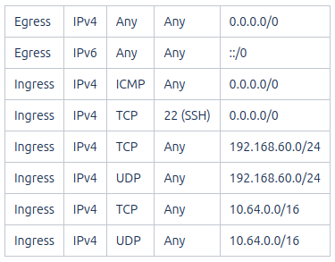

Container-as-a-Service (CaaS) Platform (**EXPERIMENTAL**)
=========================================================

Container-as-a-Service provides an easy way to run containerized software
packages in the cloud. Unlike the more widely recognized Kubernetes-as-a-Service
(KaaS) model, where users are responsible for creating and managing their
Kubernetes clusters, with CaaS we offer a fully managed orchestration platform
as a cloud service. This means you don't need an in-depth understanding of
Kubernetes infrastructure management. Instead, you can effortlessly deploy
your containers to our Kubernetes-based platform using the straightforward
kubectl command line interface.

.. important::

   Please be aware that our CaaS service is currently in an **experimental** phase, so some issues may arise. If you encounter any problems, we kindly ask you to report them to support@cloudveneto.it. Your feedback is invaluable for enhancing the quality of our service.

   
Overview
--------
Before accessing the platform, it is important to grasp some key concepts 
about the architecture, usability, security, and a few limitations. We 
assume that you already have a basic understanding of `Kubernetes <https://kubernetes.io>`__.

OSNodes vs Nodes
----------------

Please note that in this guide, we use the terms **OSNode** and **Node**. They both refer to the same concept, which is *the Kubernetes node*, but with some distinctions:

- **OSNode** stands for **OpenStackNode** and pertains to our API for creating Kubernetes nodes as Virtual Machines within an OpenStack Cloud Infrastructure, as provided by CloudVeneto;
- On the other hand, when we mention **Node**, we are referring to a Kubernetes node where the Pods run. These nodes can be instantiated either through the **OSNode API** or by using different tools and methods.

Architecture
------------
Kubernetes efficiently manages your workloads by deploying containers within pods, which are then scheduled to operate on nodes. In our CaaS, each node essentially represents a virtual machine provided within the CloudVeneto infrastructure. We refer to these nodes as **OSNodes**, which are within your administrative control but are configured by our platform. In contrast, the `control plane <https://kubernetes.io/docs/concepts/overview/components/>`__, responsible for orchestrating container deployments and managing the cluster, is completely managed by CloudVeneto.

This separation of responsibilities ensures a streamlined user experience while providing the following benefits:

- Flexibility: You have the freedom to manage your nodes according to your specific requirements in terms of CPU, RAM, and storage (flavor) without to worry about their setup;
- Isolation: Your pods run on dedicated nodes, effectively creating a virtual cluster tailored to your needs;
- Resource Sharing: You can share one or more nodes with users who belong to your CloudVeneto project;
- Service Deployment: You can either use pre-deployed services (e.g., nginx) or deploy new ones in your own namespace.

Please note that the OSNodes you create utilize the quota assigned to your CloudVeneto project. Therefore, the size of your virtual cluster is constrained by the available resources at any given moment. Since node creation typically
takes just a few minutes (usually less than 5 minutes), we encourage you to create new nodes as needed but also to promptly remove them when they are no longer necessary in order to conserve cloud resources.

Security
--------
Running pods on your own OSNdes ensures a high level of isolation. However, Kubernetes doesn't provide complete isolation for users
within the same namespace. To address this specific limitation, we have introduced integrated add-ons for Kubernetes. These enhancements include authentication
with Keystone, along with refined authorization procedures to ensure comprehensive user and resource isolation.

.. NOTE ::

   Kindly be aware that pods running on **shared nodes** do not achieve full isolation as they share the same computing resources (virtual machine) and rely on the security capabilities of the  container runtime, such as Docker or Containerd.

   
Accessing the CaaS
-------------------
Since our CaaS is built on Kubernetes, accessing the platform requires the correct configuration of `kubectl <https://kubernetes.io/docs/tasks/tools/>`__, the Kubernetes management client.
For simplifying this configuration process, CloudVeneto has developed a new plugin for kubectl: **kubectl-openstack**. This plugin set up the kubeconfig file with the appropriate authentication method for Keystone (OpenStack). 

Configuring kubectl with the kubectl-openstack plugin
-----------------------------------------------------
This section explains how to install and configure our plugin.

Prerequisites
^^^^^^^^^^^^^
-  install kubectl as described in this (`guide <https://kubernetes.io/docs/tasks/tools/>`__)
-  have an OpenStack password configured through the CloudVeneto dashboard as described in this `page <https://userguide.cloudveneto.it/en/latest/GettingStarted.html#password-management>`__.

Plugin installation
^^^^^^^^^^^^^^^^^^^
Download `<https://confluence.infn.it/download/attachments/135594229/kubectl-openstack?version=4&modificationDate=1695203796000&api=v2>`__ (linux version), then make the file executable using the command 'chmod 755 kubectl-openstack', and finally, copy it to the directory '/usr/local/bin/.

Usage
^^^^^
To view the syntax and the list of parameters use the help:
::

    $ kubectl-openstack --help
    Usage: kubectl-openstack [FLAG] -user=<USERNAME> -password=<PASSOWRD> -project=<PROJECT>
 
    Options:
      -force
            overwrite the existing configuration
      -password string
            your CloudVeneto password
      -project string
            your CloudVeneto project
      -user string
            your CloudVeneto username

The following example configures kubectl selecting CMS as project:

::

    $ kubectl-openstack -user=zangrand@infn.it -password=******** -project=CMS
    kubectl configured correctly

After configuring kubectl with the kubectl-openstack plugin, the *kubeconfig* file
(/home/<username>/.kube/config) is either created or updated if it already exists.
This file contains the Keystone token and various parameters essential for kubectl
to manage authentication.

In scenarios where you belong to multiple CloudVeneto projects, you can utilize the
*kubectl-openstack* command to configure kubectl for all your projects seamlessly.

Now you can access the CaaS:

::

    $ kubectl get pods
    No resources found in cms namespace.

How to Create and Manage OSNodes
--------------------------------
In this section we explain how to create and manage your OSNodes.

Prerequisites
^^^^^^^^^^^^^
Before you can create and manage OSNodes in Kubernetes, make sure you have completed the following prerequisites:

-  Ensure that your kubectl is correctly configured with the kubectl-openstack plugin.
-  Verify the existence of the 'K8S' security group in the CloudVeneto project with the following rules, or create it if missing:

Creating a new OSNode
^^^^^^^^^^^^^^^^^^^^^
To create a new OSNodes in your Kubernetes cluster, you'll use kubectl, the standard Kubernetes command-line interface. Specifically, you will utilize the kubectl apply command, which takes a YAML file as input.

The YAML file required to create a new OSNode should follow this structure:

::

    ---
    apiVersion: osnode.infn.it/v1
    kind: OpenStackNode
    metadata:
      name: NODE_NAME
    spec:
      flavor: FLAVOR_NAME
      keyPair: KEYPAIR_NAME
      policy: [shared | private ]

- NODE_NAME: <Unique node name>
- FLAVOR_NAME: <CloudVeneto flavor name>
- KEYPAIR_NAME: <User-defined SSH keypair name>
- shared | private: <Choose one: shared or private> 

.. important ::

   Kindly be aware that pods running on **shared nodes** do not achieve full isolation as they share the same computing resources (virtual machine) and rely on the security capabilities of the container runtime, such as Docker or Containerd. **Pods running on shared nodes could be accessed by the node's owner**.

In the following example, we request the creation of two OSNodes (osn-01 and osn-02), the first being shared and the second private, with different flavors (cloudveneto.medium and cloudveneto.large).
Both nodes use the same SSH keypair (my-key):

::

   $ cat osnode.yml
   ---
   apiVersion: osnode.infn.it/v1
   kind: OpenStackNode
   metadata:
     name: osn-01
   spec:
     flavor: cloudveneto.medium
     keyPair: my-key
     policy: shared
    
   ---
   apiVersion: osnode.infn.it/v1
   kind: OpenStackNode
   metadata:
     name: osn-02
   spec:
     flavor: cloudveneto.large
     keyPair: my-key
     policy: private

Copy and paste the above yaml code into an empty (osnode.yml) file, then execute the following command:

::

   $ kubectl apply -f osnode.yml
   openstacknode.osnode.infn.it/osn-01 created
   openstacknode.osnode.infn.it/osn-02 created

Verifying the OSNode status
^^^^^^^^^^^^^^^^^^^^^^^^^^^
To check the status of one or more OSNodes in your Kubernetes cluster, you can use the following commands:

- To list all OSNodes and their basic information:
::

   $ kubectl get osn
   NAME     PHASE     OWNER                 NODE ID                POLICY    PROVIDER      VM IPV4        AGE
   osn-01   Running   zangrand-at-infn.it   osn-01-1696949601872   shared    CloudVeneto   10.64.53.91    13d
   osn-02   Running   zangrand-at-infn.it   osn-02-1696949605128   private   CloudVeneto   10.64.53.251   13d

**Please note that each OSNode has a Kubernetes Node associated to it** (e.g. osn-01 -> osn-01-1696949601872).

- To list all OSNodes with additional details, including flavor, status, and IP address:
::

   $ kubectl get osn -o wide
   NAME     PHASE     OWNER                 NODE ID                POLICY    PROVIDER      VM FLAVOR            VM STATUS   VM IPV4        AGE
   osn-01   Running   zangrand-at-infn.it   osn-01-1696949601872   shared    CloudVeneto   cloudveneto.medium   ACTIVE      10.64.53.91    13d
   osn-02   Running   zangrand-at-infn.it   osn-02-1696949605128   private   CloudVeneto   cloudveneto.medium   ACTIVE      10.64.53.251   13d

- To view detailed information about a specific OSNodes (replace osn-01 with the desired OSNodes name):
::

   $ kubectl get osn -o wide osn-01
   NAME     PHASE     OWNER                 NODE ID                POLICY    PROVIDER      VM FLAVOR            VM STATUS   VM IPV4        AGE
   osn-01   Running   zangrand-at-infn.it   osn-01-1696949601872   shared    CloudVeneto   cloudveneto.medium   ACTIVE      10.64.53.91    13d

Removing OSNodes
^^^^^^^^^^^^^^
To remove one or more OSNodes and their associated Virtual Machine from CloudVeneto, use the following command:
::

   $ kubectl delete osn <node_name_1> <node_name_2> ...

For example, to remove osn-01 and osn-02, you would run:
::
   $ kubectl delete osn osn-01 osn-02
   openstacknode.osnode.infn.it "osn-01" deleted
   openstacknode.osnode.infn.it "osn-02" deleted

Geeting details about your OSNode
^^^^^^^^^^^^^^^^^^^^^^^^^^^^^^^
For more detailed information about your OSNodes, you can use the following command:
::

   $ kubectl describe osn qst-gpu-01
   # kubectl -n qst describe osn qst-gpu-01
   Name:         qst-gpu-01
   Namespace:    qst
   Labels:       SECRET=bootstrap-token-mqkldv
                 osn.infn.it/projectid=55158de200964f7c8aa5ca486e6cb7ea
                 osn.infn.it/projectname=QST
                 osn.infn.it/userid=2ddd446e119b417791492e950553a055
                 osn.infn.it/username=zangrand-at-infn.it
   Annotations:  <none>
   API Version:  osnode.infn.it/v1
   Kind:         OpenStackNode
   Metadata:
     Creation Timestamp:  2023-09-27T16:22:29Z
     Finalizers:
       openstacknode/finalizer
     Generation:        2
     Resource Version:  3897894
     UID:               e29c8c4c-4f50-49ad-91bc-b6c491bcc42a
   Spec:
     Availability Zone:  nova
     Flavor:             cloudveneto.50cores249GB25GB+500GB1A
     Image:
       Id:      
       Name:    almalinux9-k8s-node-26-09-2023
     Key Pair:  Lisa
     Policy:    shared
     Provider:  cloudveneto
     Region:    regionOne
     Security Groups:
       K8S
     User Data:  
   Status:
     Created:      2023-09-27T16:29:51Z
     Description:  The node is running
     Nodeid:       qst-gpu-01-1695831749722
     Phase:        Running
     Server:
       Created:  2023-09-27T16:22:32Z
       Id:       ac4a4470-4469-4ed7-8520-db9ea8c0b56d
       ipv4:     10.64.51.42
       Name:     qst-gpu-01
       Status:   ACTIVE
       Updated:  2023-10-09T11:35:37Z
     Updated:    2023-10-09T11:35:37Z
   Events:       <none>

This can be particularly useful for troubleshooting purposes.

Runnind Pods on Shared Nodes
^^^^^^^^^^^^^^^^^^^^^^^^^^^^
By default, your Pods are scheduled on your private nodes, if available. To allow their execution on shared nodes, you must add the annotation **osn.infn.it/policy: "shared"** to your YAML file.
You can include this annotation in YAML files for various resource types, such as Deployments, ReplicaSets, and more.

In the following example, we are requesting the execution of *dnsutils* Pod on a shared node, if one is available:
::

   $ cat dnsutils.yaml
   ---
   apiVersion: v1
   kind: Pod
   metadata:
     name: dnsutils-shared
     labels:
       app: dnsutils-shared
     annotations:
       osn.infn.it/policy: "shared"
   spec:
     containers:
     - name: dnsutils
       image: gcr.io/kubernetes-e2e-test-images/dnsutils:1.3
       command:
         - sleep
         - "36000000"
       imagePullPolicy: IfNotPresent
  restartPolicy: Always

This annotation ensures that the pod can be scheduled on shared nodes, providing flexibility in your cluster's resource allocation.

.. important::

Note that with "shared", the Kubernetes scheduler allocates resources on both private and shared nodes, and not just on shared ones. Therefore, it may still select your private node. To explicitly restrict a Pod to run on specific node(s) or prefer running on particular nodes, you can utilize any of the methods outlined in this `guide <https://kubernetes.io/docs/concepts/scheduling-eviction/assign-pod-node/>`__. For security reasons, please note that the `nodeName <https://kubernetes.io/docs/concepts/scheduling-eviction/assign-pod-node/#nodename>`__ method is not allowed.

In the following example, we demonstrate how to create a Pod and request it to run on a specific node, the **glv-01-1696949601872**, associated with the **glv-01** OSNode:

First, let's verify the status of the relevant OSNodes:
::

   $ kubectl get osn -o wide osn-01
   NAME     PHASE     OWNER                 NODE ID                POLICY    PROVIDER      VM FLAVOR            VM STATUS   VM IPV4        AGE
   glv-01   Running   zangrand-at-infn.it   glv-01-1696949601872   shared    CloudVeneto   cloudveneto.medium   ACTIVE      10.64.53.91    13d
   glv-02   Running   zangrand-at-infn.it   glv-02-1696949605128   private   CloudVeneto   cloudveneto.medium   ACTIVE      10.64.53.251   13d

Now, let's create a Pod definition file (*dnsutils.yaml*) that specifies our preferences:
::

   $ cat dnsutils.yaml
   ---
   apiVersion: v1
   kind: Pod
   metadata:
     name: dnsutils-shared
     labels:
       app: dnsutils-shared
     annotations:
       osn.infn.it/policy: "shared"
   spec:
     containers:
     - name: dnsutils
       image: gcr.io/kubernetes-e2e-test-images/dnsutils:1.3
       command:
         - sleep
         - "36000000"
       imagePullPolicy: IfNotPresent
  nodeSelector:
    kubernetes.io/hostname: glv-01-1696949601872
  restartPolicy: Always

Apply this Pod configuration to create the Pod:
::

   $ kubectl apply -f dnsutils.yaml
   pod/dnsutils-shared created

You can now check the Pods to see that the dnsutils-shared Pod is running on the specified node:
::
   $ kubectl get pods -o wide
   NAME              READY   STATUS    RESTARTS   AGE   IP             NODE                   NOMINATED NODE   READINESS GATES
   dnsutils-shared   1/1     Running   0          51m   10.244.11.42   glv-01-1696949601872   <none>           <none>
 
