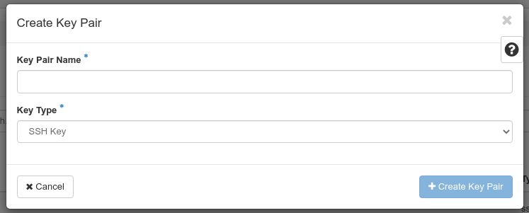
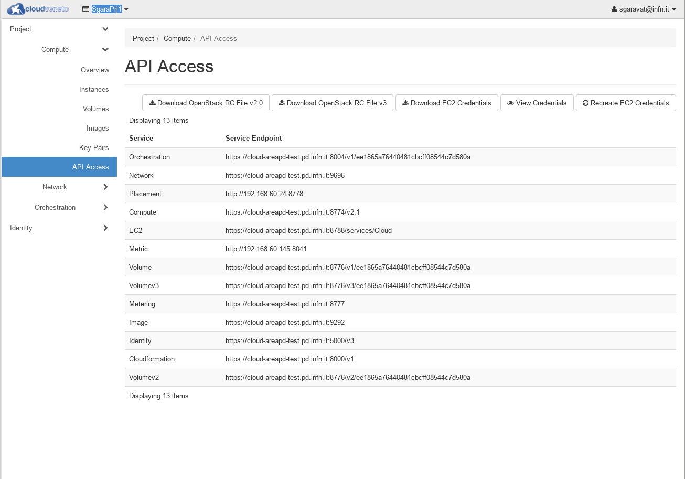
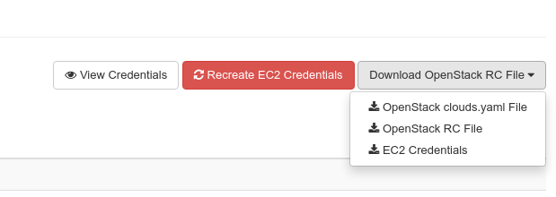

..    include:: <isonum.txt>

Getting Started
===============

Access the Cloud through the Dashboard
--------------------------------------

Once you have been given an account, you can access the functionality
provided by the Cloud. There are several ways of interacting with the
Cloud. The simplest one is the dashboard, a web based GUI.

To access the production service of CloudVeneto via the dashboard, you
must simply go to https://cloudveneto.ict.unipd.it/dashboard/ or
https://cloud-areapd.pd.infn.it/dashboard/ in a browser.

.. image:: ./images/dashboard_prod.png 
   :align: center

You can now log either using the INFN-AAI credentials, the University of
Padova Single Sign On (SSO) system, or using the username and password.

Creating a keypair
------------------
.. _CreatingAKeypair:

You can now proceed creating a key-pair. This is a secret key which
will allow you to interact with your virtual machine once it is created.
This key should be handled with similar security to a password or an ssh
key so it should only be stored in a secure directory such as a private
area in your home folder.

The steps are as follows:

-  Open the **Compute** tab on the left side

-  Select **Key Pairs**

-  In the Key Pairs section, select **Create Key Pair**.

You will need to give the keypair a name, such as *my\_key*. Select *SSH Key* as **Key Type**.

On completion of the operation, a file *my\_key.pem* will be downloaded to
your computer.

.. WARNING ::

    Be careful not to loose the file you just downloaded since there is
    no easy way to download it again.

This file should be stored in a safe location. To keep it private, run: ::

  chmod 600 my_key.pem

Importing your keypair
----------------------

You might already have an ssh key you use to remotely access machines.
This mean you already have under the *.ssh* directory in your home folder
a couple of files named *id\_rsa* (or *id\_dsa*) and *id\_rsa.pub* (or
*id\_dsa.pub*). If, on the machine you want to log on, your *id\_rsa.pub*
has been authorized you can access the machine without providing a
password.

Importing your public key allow you to 'inject' it on any newly created
VM in your project.

The steps are as follows:

-  Open the **Compute** tab on the left side

-  Select **Key Pairs**

-  In the **Key Pairs** section, select **Import Public Key**.

You will need to give the keypair a name (your full username is a good
choice), e.g. *paolomazzon*.

On the "Public Key" field paste the content of your *id\_rsa.pub* file

.. image:: ./images/import_keypair.png
   :align: center

Finally click on the **Import Public Key** button

.. WARNING ::

    Be careful not to paste the content of your private key, the one
    without the '.pub' extension.

You can now use your key pair when instantiating a VM as an access
method.

Setting security group(s)
-------------------------
.. _SecurityGroups:

Security groups are sets of IP rules (firewall) that define networking
access and are applied to all instances within a project using that
group. As described in :ref:`Creating Virtual Machines <creatingvms>`, when you create an instance you have to
specify the security group to be used.

To set such IP rules, users can either add them to the *default* security
group or can create a new security group with the desired rules.

For example the following procedure enables SSH and ICMP (ping) access
to the *default* security group. The rules apply to all instances within a
given project using this security group, and should be set (just once)
for every project, unless there is a reason to inhibit SSH or ICMP
access to the instances.

This procedure can be adjusted as necessary to add additional security
group rules to a project, if needed.

-  Log in to the dashboard, choose a project, and click **Network** |rarr| **Security Groups**. The security groups that are available for this project are
   shown.

-  Select the *default* security group and click **Manage Rules**.

-  To allow SSH access, click **+ Add Rule**.

-  In the *Add Rule* dialog box, enter the following values:

   +----------+-------------+
   | Rule     | SSH         |
   +----------+-------------+
   | Remote   | CIDR        |
   +----------+-------------+
   | CIDR     | 0.0.0.0/0   |
   +----------+-------------+

.. NOTE ::

       To accept requests from a particular range of IP addresses,
       specify the IP address block in the **CIDR** box.

-  Click **Add**.

-  To add an ICMP rule, click **Add Rule**.

-  In the *Add Rule* dialog box, enter the following values:

   +-------------+-------------+
   | Rule        | All ICMP    |
   +-------------+-------------+
   | Direction   | Ingress     |
   +-------------+-------------+
   | Remote      | CIDR        |
   +-------------+-------------+
   | CIDR        | 0.0.0.0/0   |
   +-------------+-------------+

-  Click **Add**.

.. WARNING ::

    If you need to enable some services on a Virtual Machine, besides
    setting the specific IP rules through security groups, be sure that
    the relevant ports are also enabled (e.g. via firewalld) on the
    Virtual Machine.

Password management
-------------------
.. _PasswordOnlyIf:

Foreword
^^^^^^^^

.. WARNING ::

    This procedure is NOT the one to be used to change the UniPD SSO or INFN AAI password and is NOT the one to be used to change the gate password !

You need to use the procedure described in the following subsection **only if**:

-  You access the cloud through username and password and you want to
   set/change that password;

-  You want to use the cloud infrastructure through the command line (see 
   :ref:`Accessing the Cloud with command line tools<accessingthecloudthroughcli>`
   ).

Setting/changing password
^^^^^^^^^^^^^^^^^^^^^^^^^

From the OpenStack dashboard click on your user's name (on the top),
select **Settings** from the dropdown menu and then **Manage Password**.

.. image:: ./images/changepasswd_prod.png
   :align: center

.. IMPORTANT ::

    Once again: this is the password to authenticate with the Cloud
    "internal" authentication mechanism. It is uncorrelated from the
    UniPD SSO or INFN-AAI one and with the access to the gate host.

Switching between projects
--------------------------

As introduced in :ref:`Projects <projects>`, a user can be on multiple projects at the same time.
The current project is indicated by the top left dropdown menu near the
logo.

To switch between projects just open the dropdown menu (as shown in the
following figure) and select one of your available projects.

.. image:: ./images/ProjectSwitch.png
   :align: center

Accessing the Cloud with command line tools
-------------------------------------------
.. _accessingthecloudthroughcli:

It is possible to manage the Cloud using command line tools, even if
most of the functionality provided by the Cloud can be accessed through
the dashboard web interface. The
`documentation <http://docs.openstack.org/cli-reference/>`__ on the
OpenStack site contains extended information on the syntax and
installation procedure of the command line tools.

.. NOTE ::

    INFN Padova users can find the OpenStack client installed on
    *lx.pd.infn.it*.

.. IMPORTANT ::

    Command line tools can only be used with the Cloud "internal"
    authentication mechanism. Even if you normally access the cloud
    dashboard using the UniPD SSO or INFN-AAI it's now time to :ref:`set a password<PasswordOnlyIf>`.

The OpenStack tools require a set of shell environment variables in
order to run. These variables can be obtained from the dashboard and
then stored in an 'rc' file that you can source (much like your .profile
when logging into a linux server).

The environment variables are different for projects you work on.

If you log into the dashboard, you will find **API Access** under the
**Project** menu on the left hand side.

Select **Download OpenStack RC file** and then **OpenStack RC
file (Identity API v3)**, to download the rc file for your current project.
Please note that the v3 openrc file requires a quite recent version of the Openstack
client .

This file is different for each of the projects you are working on.

The downloaded rc file should be saved onto the machine you want to run
the commands from. If you use csh rather than bash/zsh for your shell,
you would need to create a new version using *setenv* rather than *export*.

Since the CloudVeneto services are secured using SSL, you will need the
**Digicert.pem** "certification authority" file. This file can be
downloaded `from here. <https://raw.githubusercontent.com/CloudVeneto/CertCA/master/Digicert.pem>`__

Once you get the file you need to edit the RC file to set the
``OS_CACERT`` variable like this:

::

    export OS_CACERT=/etc/grid-security/certificates/Digicert.pem

.. NOTE ::

    The certificate can be put anywhere on the client as long as the
    path you specify is consistent.

To test it works, source the rc script file and enter your password to
authenticate. The OpenStack command line tools can then be used, e.g.:

::

    $ . SgaraPrj1-openrc.sh 
    Please enter your OpenStack Password for project SgaraPrj1 as user sgaravat@infn.it: 
    $ openstack server list
    +--------------------------------------+--------------+--------+-------------------------+------------+
    | ID                                   | Name         | Status | Networks                | Image Name |
    +--------------------------------------+--------------+--------+-------------------------+------------+
    | 89088351-90d8-4346-8ecf-ad08750b9d9a | tinies-uno-5 | ACTIVE | SgaraPrj1-lan=10.1.1.4  | cirros     |
    | 44d12ad6-cc7e-47c3-a6d5-5e2b7c32d542 | tinies-uno-4 | ACTIVE | SgaraPrj1-lan=10.1.1.17 | cirros     |
    | 02a40340-d238-4405-b5f3-3d38d9f9b485 | tinies-uno-3 | ACTIVE | SgaraPrj1-lan=10.1.1.12 | cirros     |
    | bc6098c7-6ec6-4ac1-8aee-9e1edb33836a | tinies-uno-2 | ACTIVE | SgaraPrj1-lan=10.1.1.6  | cirros     |
    | 1a1ab1b8-a3dd-401d-a8c2-cbd30b02e066 | tinies-uno-1 | ACTIVE | SgaraPrj1-lan=10.1.1.10 | cirros     |
    | 4e2c6cc7-bc1c-49a1-951e-10b567247588 | dasgara1-2   | ACTIVE | SgaraPrj1-lan=10.1.1.11 | cirros     |
    +--------------------------------------+--------------+--------+-------------------------+------------+
    $ 

.. NOTE ::

    When you source the rc script you are asked for a password. If the
    password is wrong, you will be told (with a generic authentication
    error) only when you issue some OpenStack commands.

Accessing the Cloud through the euca2ools EC2 command line tools
----------------------------------------------------------------
.. _AccessingtheCloudthroughEC2:

The CloudVeneto also exposes a AWS EC2 compatible interface, which is one
of the de-facto standard for computational clouds.

The *euca2ools* are command line tools that can be used to interact
with an EC2 based cloud.

You can install the *euca2ools* package on your dekstop as follows:

CentOS / Fedora

::

      # yum install euca2ools

Ubuntu / Debian

::

      # apt-get install euca2ools

.. NOTE ::

    INFN-Padova users can find the euca2ools installed on
    *lx.pd.infn.it*.

The euca2ools require a set of shell environment variables in order to
run. These environment variables are different per project that you work
on.

If you log into the dashboard, you will find **API Access** under the
**Project** menu on the left hand side.

Select **Download OpenStack RC file** and then **EC2 Credentials** to download the zip file for
your current project. This zip file will be downloaded from the browser.

This file should be saved onto the machine where you want to run the
commands from, and unzipped into a private directory, e.g:

::

    $ unzip SgaraPrj1-x509.zip 
    Archive:  SgaraPrj1-x509.zip
     extracting: ec2rc.sh           

*ec2rc.sh* gives the variables for accessing the Cloud with EC2 APIs. If
you use a C shell based shell, you would need to adapt this using
setenv.

To test it, you can e.g. try the following:

::

    $ . ec2rc.sh 
    $ euca-describe-instances -I ${EC2_ACCESS_KEY} -S ${EC2_SECRET_KEY} -U ${EC2_URL}
    RESERVATIONr-xvwmks74ee1865a76440481cbcff08544c7d580adefault
    INSTANCEi-3b49020eami-2cfcb026tinies-uno-1runningsgaravat-ctest0m1.tiny2018-03-02T12:56:32Znova10.1.1.10instance-storesg-3896bec1
    INSTANCEi-ebc7c470ami-2cfcb026tinies-uno-2runningsgaravat-ctest1m1.tiny2018-03-02T12:56:32Znova10.1.1.6instance-storesg-3896bec1
    INSTANCEi-bdd57278ami-2cfcb026tinies-uno-3runningsgaravat-ctest2m1.tiny2018-03-02T12:56:32Znova10.1.1.12instance-storesg-3896bec1
    INSTANCEi-e5bc209cami-2cfcb026tinies-uno-4runningsgaravat-ctest3m1.tiny2018-03-02T12:56:32Znova10.1.1.17instance-storesg-3896bec1
    INSTANCEi-afc80fcdami-2cfcb026tinies-uno-5runningsgaravat-ctest4m1.tiny2018-03-02T12:56:32Znova10.1.1.4instance-storesg-3896bec1
    RESERVATIONr-zpz5dkpnee1865a76440481cbcff08544c7d580adefault
    INSTANCEi-e93ef61cami-2cfcb026dasgara1-2running1m1.tiny2018-01-16T08:36:44Znova10.1.1.11instance-storesg-3896bec1
    $ 

.. WARNING ::

    For some euca2ools distributions sourcing the ec2rc.sh script is not
    enough. You need to explictly specify access and secret keys and the
    endpoint with the relevant command line options, e.g.:

    ::

        $ euca-describe-instances -I ${EC2_ACCESS_KEY} -S ${EC2_SECRET_KEY} -U ${EC2_URL}

