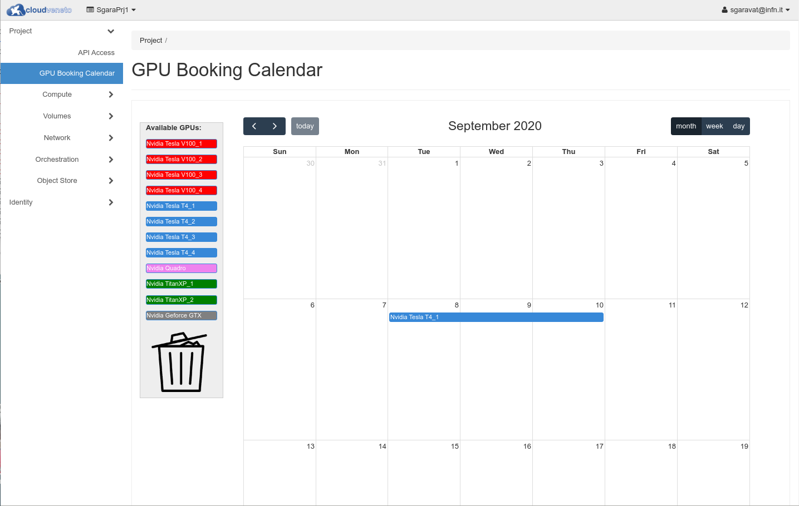
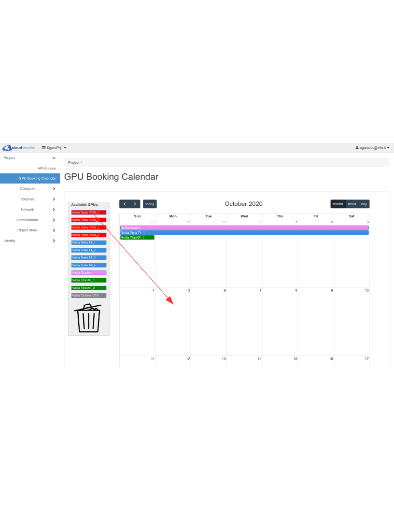
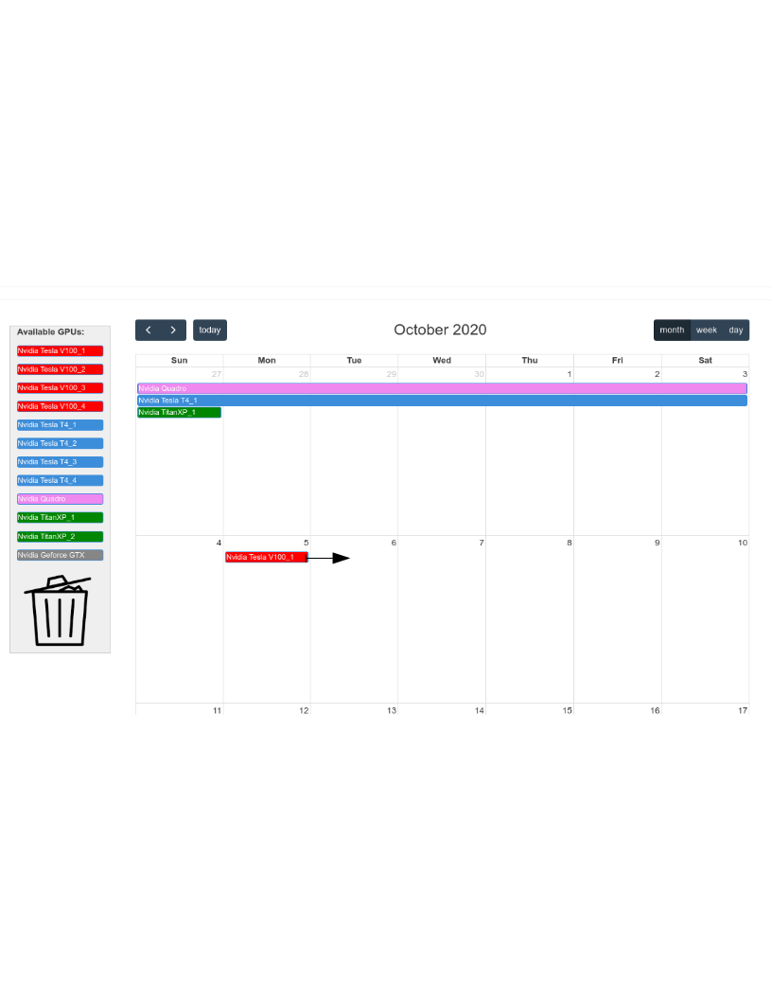
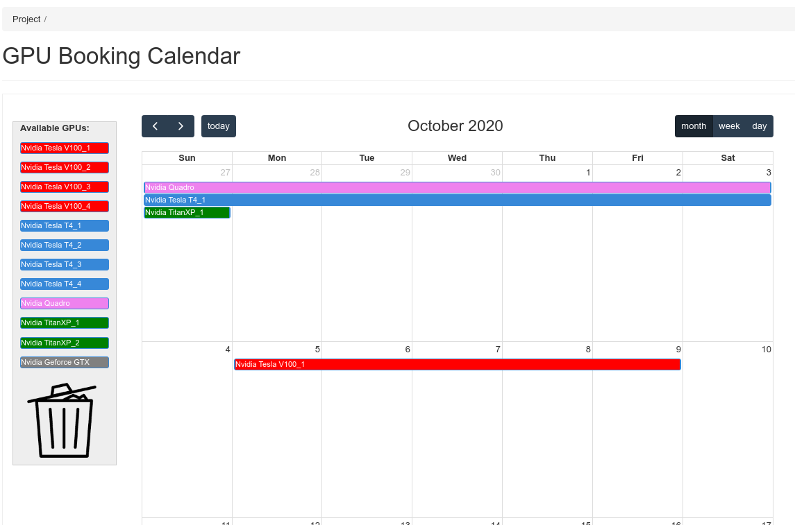
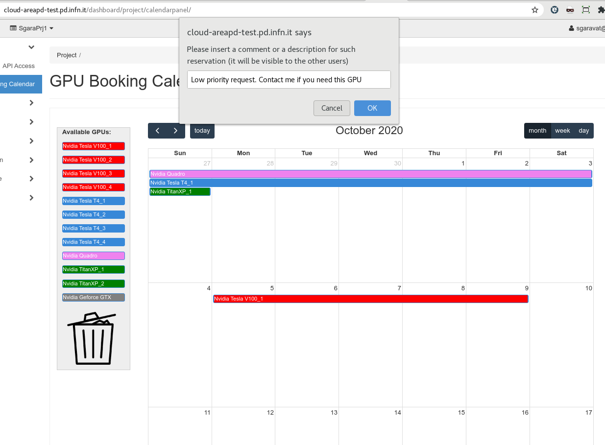

..    include:: <isonum.txt>

Managing GPUs
================
CloudVeneto provides Unipd Physics Dept. and INFN Padova users with some
GPUs (Graphics Processing Units). These are:

   * 4 GPU Nvidia V100
   * 11 GPU Nvidia Tesla T4
   * 1 GPU Nvidia Quadro RTX 6000 
   * 2 GPU Nvidia TITAN Xp
   * 1 GPU Nvidia GeForce GTX TITAN

The Nvidia T4 GPUs are divided in 2 sets:
   * the first set is composed by 4 Nvidia T4 GPUs, each one coupled with 15 
     CPU cores; 
   * the second set is composed by 7 Nvidia T4 GPUs, each one coupled with 8 
     CPU cores.

Using a CloudVeneto GPU means accessing a virtual machine which has
full access and direct control of such GPU device.

GPU instances, i.e. virtual machines which have access to one 
or more GPUs can be created only from the **HPC-Physics** project.
So, first of all, you need to request the affiliation to such project
(see :ref:`Apply for other projects<ApplyForOtherProjects>` for
the relevant instructions).

The only exception is  for the 4 T4 GPUs with 15 CPU
cores, that are usable also from the **PhysicsOfData-students** project.

.. WARNING::
  Please note that the members of the **PhysicsOfData-students** project have the priority on the
  4 T4 GPUs each one coupled with 15 CPU cores.
  Other users can use such GPUs, but they must be released within 2 days if requested by other users with higher priority.

Reserving a GPU
---------------
.. _ReservingGpu:

Before using a GPU, you need to reserve it. This can be done using a reservation 
system integrated in the dashboard.

Using the Dashboard, click on **GPU Booking Calendar**.

Let's suppose that you want to reserve a Tesla V100 GPU from Oct 5 to Oct 9.

Move the desired GPU to the first day of the reservation (October 5, in our example)

Using the mouse, you can then "enlarge" your reservation till the desired last day (October 9, in our example)

You may also associate a comment for this reservation (by clicking on it). The message can be seen
by the other users.

.. WARNING ::
  Please note that a reservation can be at most 15 days long and you may have 
  at most 2 active reservations for a specific GPU.

.. NOTE ::
  There must be a match between the username reported in the reservation and the username of the relevant virtual machine.
  Therefore the reservation must be done by the same user that will then create the virtual machine.

.. WARNING::
  Please note that the members of the **PhysicsOfData-students** project have the priority on the
  4 T4 GPUs each one coupled with 15 CPU cores.
  Other users can use such GPUs, but they must be released within 2 days if requested by other users with higher priority.

To delete a reservation, you simply need to move it to the trash bin.

.. NOTE ::
  The reservation system that has been just described, is visible only to the 
  projects
  that have access to the GPUs (i.e. the **HPC-Physics** project and, just 
  for 4 T4 GPUs,
  the **PhysicsOfData-students** project)

Creating a GPU instance 
-----------------------

The instructions to create a GPU instance are the very same for
the creation of a 'standard' virtual machine (see
:ref:`Creating Virtual Machines<creatingvms>`). You will only have to
pay attention to use one of these special flavors:

- **cloudveneto.18cores56GB20+40GB1V100**

  Flavor for an instance with 1 GPU Nvidia V100,
  18 VCPUs, 56 GB of RAM, 20 GB of ephemeral
  root disk space, 40 GB of extra ephemeral disk space.

- **cloudveneto.36cores112GB20+80GB2V100**

  Flavor for an instance with 2 GPU Nvidia V100,
  36 VCPUs, 112 GB of RAM, 20 GB of ephemeral root disk space,
  80 GB of extra ephemeral disk space.

- **cloudveneto.15cores90GB25G+500GB1T4**

  Flavor for an instance with 1 GPU Nvidia T4,
  15 VCPUs, 90 GB of RAM, 25 GB of ephemeral root disk space,
  500 GB of extra ephemeral disk space.

- **cloudveneto.8cores90GB20+2000GB1T4**

  Flavor for an instance with 1 GPU Nvidia T4,
  8 VCPUs, 90 GB of RAM, 20 GB of ephemeral root disk space,
  2000 GB of extra ephemeral disk space.

- **cloudveneto.30cores180GB25G+600GB2T4**

  Flavor for an instance with 2 GPUs Nvidia T4,
  30 VCPUs, 180 GB of RAM, 25 GB of ephemeral root disk space,
  600 GB of extra ephemeral disk space.

- **cloudveneto.16cores180GB20+4000GB2T4**

  Flavor for an instance with 2 GPUs Nvidia T4,
  16 VCPUs, 180 GB of RAM, 20 GB of ephemeral root disk space,
  4000 GB of extra ephemeral disk space.

- **cloudveneto.32cores360GB20+8000GB4T4**
  
  Flavor for an instance with 4 GPUs Nvidia T4,
  32 VCPUs, 360 GB of RAM, 20 GB of ephemeral root disk space,
  8000 GB of extra ephemeral disk space.

- **cloudveneto.8cores40GB20+500GB1Quadro**
  
  Flavor for an instance with 1 GPU Nvidia Quadro RTX 6000,
  8 VCPUs, 40 GB of RAM, 20 GB of ephemeral root
  disk space, 500 GB of extra ephemeral disk space.

- **cloudveneto.8cores40GB20+400GB1TitanXP**

  Flavor for an instance with 1 GPU Nvidia Titan Xp,
  8 VCPUs, 40 GB of RAM, 20 GB of ephemeral root
  disk space, 400 GB of extra ephemeral disk space.
 
- **cloudveneto.16cores80GB20+800GB2TitanXP**

  Flavor for an instance with 2 GPUs Nvidia Titan Xp,
  16 VCPUs, 80 GB of RAM, 20 GB of ephemeral root
  disk space, 800 GB of extra ephemeral disk space.

- **cloudveneto.4cores20GB20+200GB1GeforceGtx**

  Flavor for an instance with 1 GPU Nvidia GeForce GTX TITAN,
  4 VCPUs, 20 GB of RAM, 20 GB of ephemeral root
  disk space, 200 GB of extra ephemeral disk space.

.. WARNING ::
   When you snapshot or shelve an instance created using one of such flavors, please
   consider that only the root disk is saved. The content of the
   extra ephemeral disk is not saved !

.. NOTE ::

   While some flavors allow the use of multiple GPUs, please note that the existing hardware is not optimized
   for GPU-to-GPU communications.

Storage for GPU instances
-------------------------

Flavors for GPU instances have a 20-25 GB ephemeral root disk.

Usually there is also a larger supplementary ephemeral disk
(see :ref:`here<FlavorsWithSupEpDisk>` for more information) that can be used if 
more fast disk space is needed.
This ephemeral storage is in fact usually implemented
by fast (SSD/NVMe) disks, usually faster with respect than 
persistent volumes.

However this ephemeral storage doesn't provide a high level of reliability.
So please make sure that your important data are stored on persistent
volumes (see :ref:`Volumes<volumes>`). 

.. WARNING ::
   Only the content of the 'root disk' is saved when you do a snapshot or a shelve of a VM.
   So if the instance was created using a flavor that has a supplementary ephemeral disk, the content of such disk
   is NOT saved and will be lost.

Images for GPU instances
------------------------

You are responsible to create a "GPU ready" image (see 
:ref:`User Provided Images <userprovidedimages>` and 
:ref:`Building Images <buildingimages>`). or you can use a "standard"
image and then install the the needed GPU drivers and software.

`These <https://developer.nvidia.com/cuda-downloads>`__ 
instructions explain how to install CUDA toolkit and
the NVIDIA drivers.

What do do when your reservation expires
-----------------------------------------
When your reservation for a GPU expires, you need to release it so that it can be used by other users.

Possible options are:

  * Deleting the instance  
  * Shelving the instance (see :ref:`Shelving Virtual Machines<ShelvingVMs>`)

The second option is useful if you need to use that VM again in the near future.

.. WARNING ::
   Only the content of the 'root disk' is saved when you do a shelve (or a snapshot) of a VM.
   So if the instance was created using a flavor that has a supplementary ephemeral disk, the content of such disk
   is NOT saved and will be lost.

Monitoring
----------
Unfortunately it is not straightforward to see which GPUs are being
used and which ones are available using the CloudVeneto Openstack dashboard.

You can refer to `this page <https://cloud-areapd.pd.infn.it/GPUs>`__ for
such information (please note that this page is updated every 30 minutes).

Policies
--------
Please consider the following policies when using GPU instances:

- GPU enabled flavors must be used **only** when a GPU is needed

- Since there is a high request to use GPUs, please delete or shelve your
  instance as soon as you don't need it anymore. 
  This is because virtual machines, even if 
  idle or in shutdown state, allocate resources (GPUs in particular) which 
  therefore aren't available to other users.

- Once activated, your virtual instance is **managed by you**. 

- Before creating an instance using one or more GPUs, please register such allocation 
  as explained :ref:`here<ReservingGpu>`.
  Instances for which there isn't a reservation 
  can be deleted by the Cloud administrators.

- The project HPC-Physics must be used **only** to instantiate virtual
  machines with GPUs.
