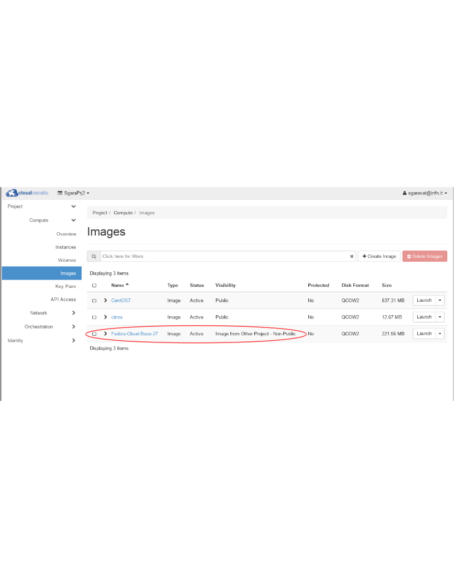

..    include:: <isonum.txt>

Managing Images
===============

In a cloud environment, Virtual Machines are instantiated from images.
These images are registered in an Image Management Service, in our case
provided by the **Glance** OpenStack component.

Public Images
-------------
.. _publicimages:

Some images in the CloudVeneto are provided by the Cloud administrators.
These images are public, and visible to all users. They appear with
**Visibility** equal to **Public** in the **Compute** |rarr| **Images** menu.

In CloudVeneto, public images are usually provided in QCOW2 format.
They are fully resizable also with respect to the disk size.

.. image:: ./images/public_images.png
   :align: center

Public Images for INFN Padova users
^^^^^^^^^^^^^^^^^^^^^^^^^^^^^^^^^^^

The **SL6x-INFNPadova-x86-64-<date>** and
**CentOS7x-INFNPadova-x86-64-<date>** images are basic SL6.x / CentOS
7.x images which also include *cloud-init* to perform contextualization
based on the user data specified when the VM are instantiated. They also
configure CVMFS and the relevant squid servers.

Such images also configure the Padova LDAP server for user
authentication. This means that it is just necessary to “enable” the
relevant accounts on the VM adding in the /etc/passwd file:

::

                                                                                         
    +name1::::::                                                                                 
    +name2::::::                                                                                 
    ...                                                                                          

and creating their home directories.

Changes done in /etc/passwd could not be applied immediately by the
system. In this case a:

::

                                                                                         
    nscd -i passwd                                                                               

should help.

You can access instances created using these images, through ssh using
the Cloud keypair, considering the 'root' account, e.g.:

::

    ssh -i ~/private/my_key root@10.64.17.3

.. NOTE ::
    The **SL6x-INFNPadova-x86-64-<date>** and
    **CentOS7x-INFNPadova-x86-64-<date>** images also allow INFN-Padova
    system administrators to log (with admin privileges) on the
    instance.

    `INFN-Padova computing and Network
    service <https://www.pd.infn.it/eng/computing-and-networking/>`__
    (supporto@pd.infn.it) can provide support only for instances created
    using such images (only to INFN-Padova users).

User Provided Images
--------------------
.. _userprovidedimages:

Users can provide their own images and upload them to the Cloud Image
service: these images are private, meaning that they are only available
to the users of the project they are uploaded for.

.. NOTE ::
    Users are not allowed to publish public (i.e. available to all
    projects) images.

Many open source projects such as Ubuntu and Fedora produce
pre-built images which can be used for certain clouds. If these are
available, it is much easier to use them compared to building your own.

-  `Fedora repository <https://getfedora.org/cloud/>`__

-  `Ubuntu repository <https://cloud-images.ubuntu.com/>`__

Using an Ubuntu image as an example, after you downloaded the image from
the relevant web site, to upload such image using the command line tools
(see :ref:`Accessing the Cloud with command line tools<accessingthecloudthroughcli>`)
you need to:

-  Authenticate to OpenStack using the openrc script:

   ::

       $ . demo-openrc.sh
             

-  Issue the following command:

   ::

       $ openstack image create --private --disk-format=qcow2 \
             --container-format=bare \
             --file trusty-server-cloudimg-amd64-disk1.img ubuntu-trusty
             

Once loaded, the image can then be used to create virtual machines.

Some system software is delivered in ISO image format. For example,
these steps show how to create an image from the Freedos ISO available
from `here <http://www.freedos.org/download/download/fd11src.iso>`__

::

    $ openstack image create --private --disk-format=iso \
    --container-format=bare --file=fd11src.iso freedos11

.. NOTE ::
    In CloudVeneto image size is limited to 25 GB.

Sharing Images
--------------

As mentioned before, users are not allowed to publish public images.
However images can be shared between different projects. This is
currently only possible via the command line tools.

If an image has been uploaded to your currently active project, using
the procedure described in :ref:`User Provided Images <userprovidedimages>`, you can then use the
**openstack image add project** operation to share that image with
another project.

To share an image, first source the project profile for the project
containing the image you want to share (e.g. *Fedora-Cloud-Base-27*) and
find its id with the **openstack image list** command
(*d4b02b71-755e-47ad-bb27-1ea5c23bf7cb* in the example):

::

    $ openstack image list
    +--------------------------------------+----------------------+--------+
    | ID                                   | Name                 | Status |
    +--------------------------------------+----------------------+--------+
    | 7ebe160d-5498-477b-aa2e-94a6d962a075 | CentOS7              | active |
    | d4b02b71-755e-47ad-bb27-1ea5c23bf7cb | Fedora-Cloud-Base-27 | active |
    | 071668fc-dfeb-4956-996a-d2a487755709 | cirros               | active |
    +--------------------------------------+----------------------+--------+

You then need to change (to 'Shared') the visibility of the image:

::

    openstack image set --property visibility=shared d4b02b71-755e-47ad-bb27-1ea5c23bf7cb

You now need to find the id of the project you wish to share the image
with. This will generally be done by looking at the openrc file of that
project and finding the *OS_PROJECT_ID* variable (in this example, it
is e81df4c0b493439abb8b85bfd4cbe071).

To share the image with id d4b02b71-755e-47ad-bb27-1ea5c23bf7cb to the
project whose id is e81df4c0b493439abb8b85bfd4cbe071, use the command:

::

    $ openstack image add project d4b02b71-755e-47ad-bb27-1ea5c23bf7cb e81df4c0b493439abb8b85bfd4cbe071 
    +------------+--------------------------------------+
    | Field      | Value                                |
    +------------+--------------------------------------+
    | created_at | 2018-03-19T16:09:21Z                 |
    | image_id   | d4b02b71-755e-47ad-bb27-1ea5c23bf7cb |
    | member_id  | e81df4c0b493439abb8b85bfd4cbe071     |
    | schema     | /v2/schemas/member                   |
    | status     | pending                              |
    | updated_at | 2018-03-19T16:09:21Z                 |
    +------------+--------------------------------------+

.. NOTE ::
    Because of a bug in OpenStack this command could return an error message such as: 
    ::
      403 Forbidden: Not allowed to create members for image d4b02b71-755e-47ad-bb27-1ea5c23bf7cb. (HTTP 403)
    but actually the command worked.

Then a member of the target project (with id e81df4c0b493439abb8b85bfd4cbe071
in our example) needs to accept the image:

::

    $ openstack image set --accept d4b02b71-755e-47ad-bb27-1ea5c23bf7cb

In the target project, the image will appear in the image list:

Building Images
---------------

Users can also build custom images, that can then been uploaded in the
Cloud Image service as described in :ref:`User Provided Images <userprovidedimages>`.

There are several tools providing support for image creation. Some of
them are described in the `Openstack
documentation <http://docs.openstack.org/image-guide/content/ch_creating_images_automatically.html>`__.

Deleting Images
---------------

Images that are not used anymore can be deleted. Deletion of images is
permanent and cannot be reversed.

To delete an image, log in to the dashboard and select the appropriate
project from the drop down menu at the top left. On the **Compute** |rarr| **Images**
page select the images you want to delete and click **Delete Images**.
Confirm your action pressing the **Delete Images** again on the confirmation
dialog box.

.. WARNING ::
    Don't delete an image if there are virtual machines created
    using this image, otherwise these VMs won't be able to start if
    rebooted.
