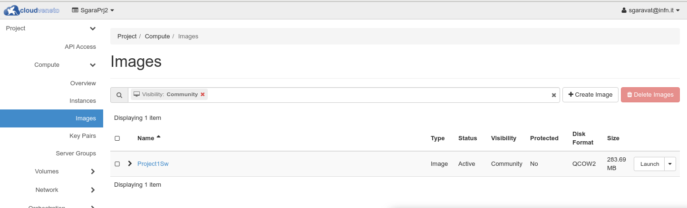

..    include:: <isonum.txt>

Managing Images
===============

In a cloud environment, Virtual Machines are instantiated from images.
These images are registered in an Image Management Service, in our case
provided by the **Glance** OpenStack component.

There are several types of images:

* **Public images**

  These are images provided by the CloudVeneto administrators. They are visible to all users.

* **Private images**

  A private image is owned by a specific project and cannot be viewed or used by other projects.

* **Shared images**

  A shared image is a private image that can be viewed/used by specific other projects that
  the image owner adds as "members" to the image.

* **Community images**

  A community image is an image uploaded by a project, and such project  
  wants other projects use such image, but isn't interested in maintaining a relationship with these tenants by 
  making them image members. 

Public Images
-------------
.. _publicimages:

Public images are provided by the CloudVeneto administrators.
These images are visible to all users. They appear with
**Visibility** equal to **Public** in the **Compute** |rarr| **Images** menu.

.. image:: ./images/public_images.png
   :align: center

.. NOTE ::
    Users are not allowed to publish public (i.e. available to all
    projects) images.

Public Images for INFN Padova users
^^^^^^^^^^^^^^^^^^^^^^^^^^^^^^^^^^^
.. _PublicImagesPd:

The **<OperatingSystem>-INFNPadova-x86-64-<date>** 
images:

- include *cloud-init* to perform contextualization
  based on the user data specified when the VM are instantiated
- configure CVMFS and the relevant squid servers
- allow INFN-Padova system administrators (see 
  `INFN-Padova computing and Network
  service <https://www.pd.infn.it/eng/computing-and-networking/>`__)
  to log (with admin privileges) on the
  instance
- configure the INFN Padova LDAP server for user
  authentication. This means that it is just necessary to “enable” the
  relevant accounts on the VM adding in the /etc/passwd file:

::

                                                                                         
    +name1::::::                                                                                 
    +name2::::::                                                                                 
    ...                                                                                          

and creating their home directories (and changing their ownership).
E.g.

::

   sudo mkdir /home/pippo
   sudo id pippo

The last command will return a string "<userid>(pippo) gid=<groupid>(utenti) groups=...." with the userid and gid to be used in the chown command:

::

   sudo chown -R <userid>.<groupid> /home/pippo

You might also want to set a different home directory wrt the one specified in LDAP, e.g.:

::

    +pippo:::::/ehome/pippo:

Changes done in /etc/passwd could not be applied immediately by the
system. In this case a:

::

                                                                                         
    nscd -i passwd                                                                               

should help.

.. WARNING ::
    These images for INFN-Padova users are supposed to be used only by INFN
    Padova users and only for projects using a INFN (i.e. 10.64.x.0/24 
    network). They can't be used on projects using
    10.67.x.0/24 networks.

Private Images
--------------
.. _userprovidedimages:

Users can provide their own images and upload them to the Cloud Image
service: these images are private, meaning that they are only available
to the users of the project they are uploaded for.

Many open source projects such as Ubuntu and Fedora produce
pre-built images which can be used for certain clouds. If these are
available, it is much easier to use them compared to building your own.

-  `Fedora repository <https://getfedora.org/cloud/>`__

-  `Ubuntu repository <https://cloud-images.ubuntu.com/>`__

-  `CentOS images <http://cloud.centos.org/centos/>`__

Using an Ubuntu image as an example, after you downloaded the image from
the relevant web site, to upload such image proceed as follows:

-  Be sure you have selected the right Project from the dropdown menu on
   the top.

-  Go to **Compute** |rarr| **Images** on the left hand menu. This will display the
   list of public and private images currently available in your project.

  .. image:: ./images/Images.png
     :align: center

- Click on **+Create Image**. The following form will appear:

  .. image:: ./images/CreateImage.png
     :align: center

- Fill the needed fields. In particular specify a name for this image (to be specified in the **Image Name** field). 
  Select
  the downloaded file in the **Image Source** field, select the **Format**. Select *Private* as **Visibilility**

- When done, click on **Create Image**. 

Once loaded, the image can then be used to create virtual machines.

.. NOTE ::
    Images are usually provided in several formats. The most used ones in Cloud
    environments are 'qcow2' and 'raw'. 

    When considering the format to choose, you should take into account how
    the instantiation of a virtual machine on a Cloud compute node works.
    When a virtual machine is instantiated, first
    of all the relevant image is staged to the target hypervisor, if needed 
    (i.e. if this is the first instance created on that compute node using 
    this image).
    Then the image is converted to raw, if it is not already in that
    format.

    A qcow2 image is usually much smaller with respect to the same image 
    provided in raw format.
    This means that:

    - the registration to the OpenStack image service for images in qcow2 
      format is faster with respect to images in raw format
    - the staging of images in qcow2 format to the target compute node
      is faster with respect to images in raw format

    However qcow2 images, as reported above, need to be translated into
    raw format, and this can take a non negligible time, in particular for
    images with a large virtual disk size. 

.. WARNING ::
    In CloudVeneto image size is limited to 25 GB.

Shared Images
-------------

As mentioned before, users are not allowed to publish public images.
However private images can be shared between different projects. This is
currently only possible via the command line tools.

If an image has been uploaded to your currently active project, using
the procedure described in :ref:`User Provided Images <userprovidedimages>`, you can then use the
**openstack image add project** operation to share that image with
another project.

To share an image, first source the project profile for the project
containing the image you want to share (e.g. *Fedora-Cloud-Base-27*) and
find its id with the **openstack image list** command
(*d4b02b71-755e-47ad-bb27-1ea5c23bf7cb* in the example):

::

    $ openstack image list
    +--------------------------------------+----------------------+--------+
    | ID                                   | Name                 | Status |
    +--------------------------------------+----------------------+--------+
    | 7ebe160d-5498-477b-aa2e-94a6d962a075 | CentOS7              | active |
    | d4b02b71-755e-47ad-bb27-1ea5c23bf7cb | Fedora-Cloud-Base-27 | active |
    | 071668fc-dfeb-4956-996a-d2a487755709 | cirros               | active |
    +--------------------------------------+----------------------+--------+

You then need to change (to 'Shared') the visibility of the image:

::

    openstack image set --property visibility=shared d4b02b71-755e-47ad-bb27-1ea5c23bf7cb

You now need to find the id of the project you wish to share the image
with. This will generally be done by looking at the openrc file of that
project and finding the *OS_PROJECT_ID* variable (in this example, it
is e81df4c0b493439abb8b85bfd4cbe071).

To share the image with id d4b02b71-755e-47ad-bb27-1ea5c23bf7cb to the
project whose id is e81df4c0b493439abb8b85bfd4cbe071, use the command:

::

    $ openstack image add project d4b02b71-755e-47ad-bb27-1ea5c23bf7cb e81df4c0b493439abb8b85bfd4cbe071 
    +------------+--------------------------------------+
    | Field      | Value                                |
    +------------+--------------------------------------+
    | created_at | 2018-03-19T16:09:21Z                 |
    | image_id   | d4b02b71-755e-47ad-bb27-1ea5c23bf7cb |
    | member_id  | e81df4c0b493439abb8b85bfd4cbe071     |
    | schema     | /v2/schemas/member                   |
    | status     | pending                              |
    | updated_at | 2018-03-19T16:09:21Z                 |
    +------------+--------------------------------------+

Then a member of the target project (with id e81df4c0b493439abb8b85bfd4cbe071
in our example) needs to accept the image:

::

    $ openstack image set --accept d4b02b71-755e-47ad-bb27-1ea5c23bf7cb

In the target project, the image will appear in the image list:

.. image:: ./images/SharedImage.png
   :align: center

Community images
----------------
Let's suppose that a project wants to make a prepared VM image available so that in order to use the project's 
software, all you have to do is boot an instance from their image. However they worry about the hassle of maintaining 
a list of "customers" (i.e. they don't want to use the image sharing stuff described in the previous section).

The vendor can make the image a community' image. Such image won't appear in user's default image lists of other 
projects (so they won't know about it unless they are motivated to seek it out).

The process to create a community image is the one described to create private images (see :ref:`private images<userprovidedimages>`):
the only difference is that the *Visibility* field must be set to *Community*.

A consumer can find a community image uploaded by another project
by doing an image list and filtering with the 'Community' value for the 'visibility' field.

 

Building Images
---------------
.. _buildingimages:

Users can also build custom images, that can then been uploaded in the
Cloud Image service as described in :ref:`User Provided Images<userprovidedimages>`.

There are several tools providing support for image creation. Some of
them are described in the `Openstack
documentation <http://docs.openstack.org/image-guide/content/ch_creating_images_automatically.html>`__.

One example is **virt-customize**, which is briefly described in the next
subsection. 

Please consider these guidelines when creating an image:

- Data inside images can be accessed by the other members of the project. 
  So please don't store sensitive information (e.g. password) in the image.
- Please make sure that the *cloud-init* and *cloud-utils* packages are installed. This is needed 
  for contextualisation (see  
  :ref:`Contextualisations<contextualisation>`), 
  which allows to customize the image after 
  installation.
- If you use Fedora, CentOS, or RHEL, the *cloud-utils-growpart* and
  *gdisk* packages must be installed, since they are needed for extending partitions. if you use Ubuntu or Debian, 
  the *cloud-initramfs-growroot* package, which supports resizing root partition on the first boot, must be installed.

.. NOTE ::
    Another possible way to create an image is:

    - instantiating a virtual machine using an already registered image
    - applying your own customization on this instance (e.g. installing new
      packages)
    - creating a snapshot of this image
    - using the snapshot to instantiate new virtual machines

    However this usually means creating very large and quite inefficient images.
    Therefore we **strongly** suggest instead to use the provided public images and applying your customizations
    using contextualization (see :ref:`Contextualisations<contextualisation>`) 
    or to create new images using one of the tools mentioned above. 
   
virt-customize
^^^^^^^^^^^^
virt-customize is a command line tool
for quickly creating customized images.
virt-customize is very easy to install (it is provided by the *libguestfs-tools-c* package).

It takes as input an image (e.g. one provided by Ubuntu/CentOS/...: see above)
and customizes them.

Documentation how to use virt-customize is provided in the relevant
`man pages <http://libguestfs.org/virt-customize.1.html>`__. 

Here we provide just one example. The following command:
   
   ::

      export LIBGUESTFS_BACKEND=direct
      virt-customize -a CentOS-7-x86_64-GenericCloud-2111.qcow2 \
        --install epel-release \
        --timezone Europe/Rome" \
        --append-line "/etc/chrony.conf:server ntp.pd.infn.it iburst" \
        --run-command "systemctl enable chronyd" \
        --run-command "sed -i 's/^SELINUX=.*$/SELINUX=disabled/' /etc/selinux/config" \
        --update 
        --selinux-relabel

takes as input a CentOS7 image file, called *CentOS-7-x86_64-GenericCloud-2111.qcow2* in qcow2 format 
and:

- installs the epel-release package
- sets the timezone
- configures chrony and enable it at boot time
- updates all packages

The resulting image should then be compressed before uploading to Openstack:

   ::

      export LIBGUESTFS_BACKEND=direct
      virt-sparsify --compress CentOS-7-x86_64-GenericCloud-2111.qcow2 centos7-compressed.qcow2

Deleting Images
---------------

Images that are not used anymore can be deleted. Deletion of images is
permanent and cannot be reversed.

To delete an image, log in to the dashboard and select the appropriate
project from the drop down menu at the top left. On the **Compute** |rarr| **Images**
page select the images you want to delete and click **Delete Images**.
Confirm your action pressing the **Delete Images** again on the confirmation
dialog box.

.. WARNING ::
    Don't delete an image if there are virtual machines created
    using this image, otherwise these VMs won't be able to start if
    rebooted.

Migrating an image to another cloud
-----------------------------------
.. _MigratingAnImageToAnotherCloud:

Sometimes it becomes necessary to migrate an image (or snapshot) from
one OpenStack cloud to another one.

In short the procedure is the following:

**In the source cloud:**

-  Download the image/snapshot as a file

**In the destination cloud:**

-  Upload the downloaded image file to the new environment

To download the image from the source cloud, you need to use the
OpenStack CLI. After having sourced the environment script of the source
cloud (as explained in :ref:`Accessing the Cloud with command line tools<accessingthecloudthroughcli>`), 
run the **openstack image list** to find the
id of the image (photo-slave in the following example):

::

    $ openstack image list | grep photo-slave
    | 753e8fa1-3f1b-407d-9294-d22b89ec3184 | photo-slave                 | active |

Then use the **openstack image save** command, using the relevant id, to
download the image file:

::

    $ openstack image save --file photo-slave.qcow2 753e8fa1-3f1b-407d-9294-d22b89ec3184

