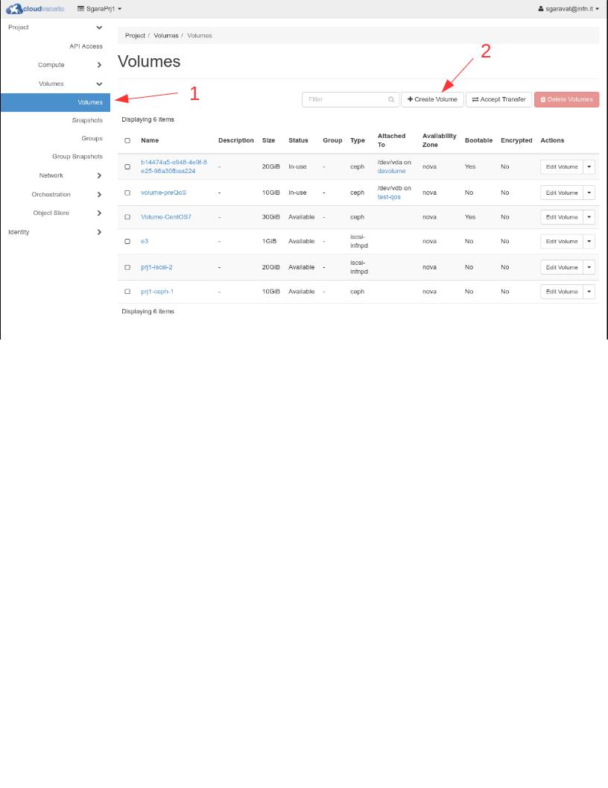
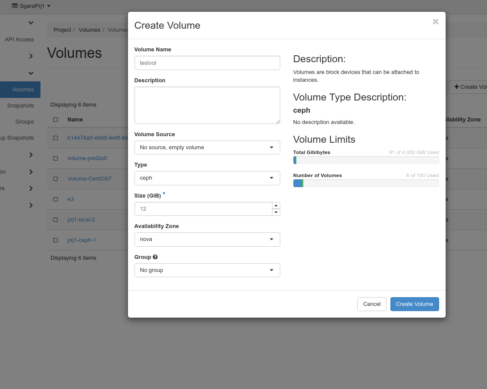
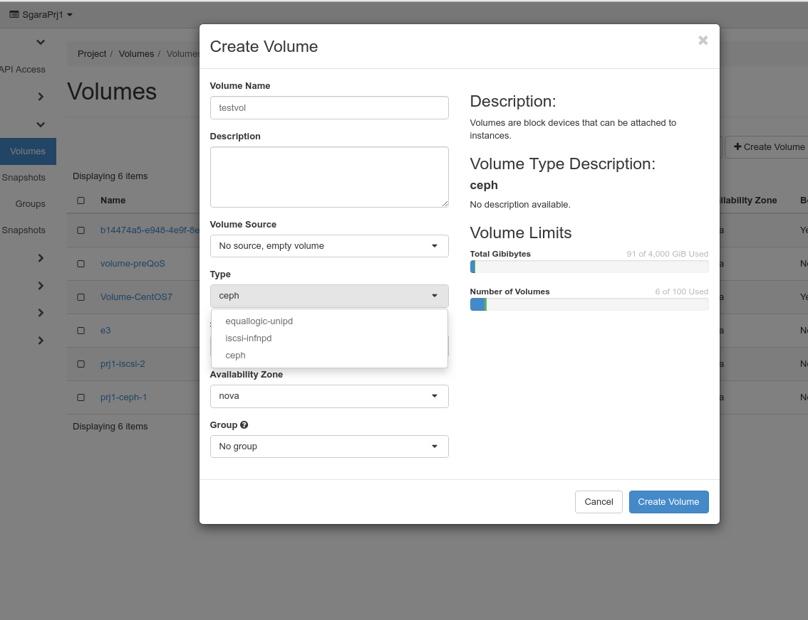
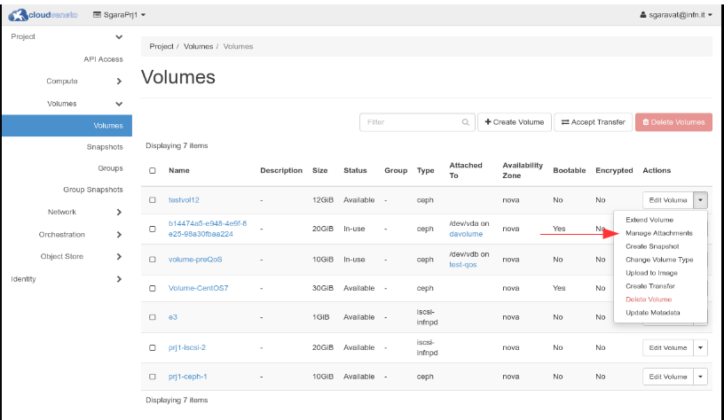
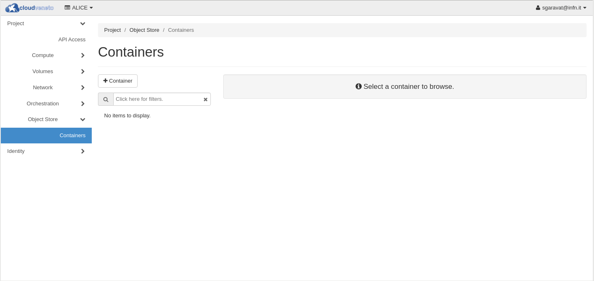
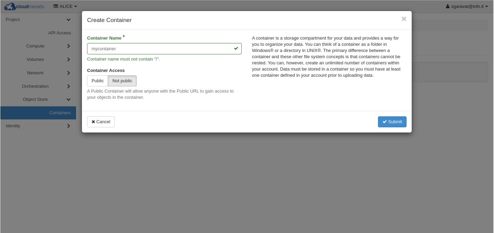
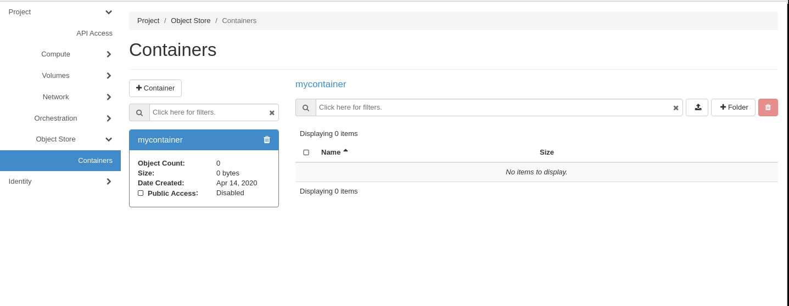
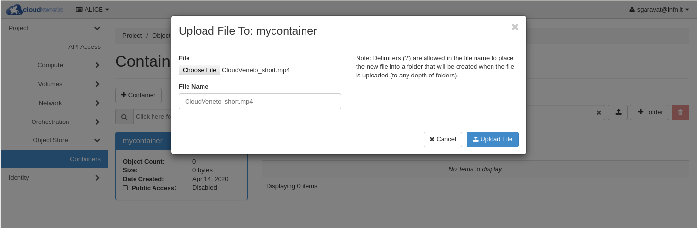

..    include:: <isonum.txt>

Managing Storage
================
There are several ways of handling disk storage in the CloudVeneto:

-  **Ephemeral storage** exists only for the life of a virtual machine
   instance. It will persist across reboots of the guest operating
   system but when the instance is deleted so is the associated storage.
   The size of the ephemeral storage is defined in the virtual machine
   flavor.

-  **Volumes** are persistent virtualized block devices independent of
   any particular instance. Volumes may be attached to a single instance
   at a time, but may be detached or re-attached to a different instance
   while retaining all data, much like a USB drive. The size of the
   volume can be selected when it is created within the quota limits for
   the particular project.

- **Object Storage** (experimental) allows to store and retrieve potentially 
  lots of data 
  with a simple API. It's built for scale and optimized for durability, 
  availability, and concurrency across the entire data set. 
  Object storage is ideal for storing unstructured data that can grow without 
  bound.

Ephemeral storage
-----------------

Ephemeral storage exists only for the life of a virtual machine
instance. It will persist across reboots of the guest operating system
but when the instance is deleted so is the associated storage. The size
of the ephemeral storage is defined in the virtual machine flavor.

Among the flavor details (that are listed in the Dashboard when a VM has
to be launched or can be seen using the *openstack flavor list*
command), there is an attribute called 'Ephemeral'. When you use a
flavor with an ephemeral disk size different from zero, the instance is
booted with an extra virtual disk whose size is indicated by the
ephemeral value. This ephemeral disk can be useful where you want to
partition the second disk or have a specific disk configuration which is
not possible within the system disk configuration.

.. WARNING ::
    Please note that backups are not performed on ephemeral storage
    systems.

Volumes
-------
.. _volumes:

Volumes are persistent virtualized block devices independent of any
particular instance. Volumes may be attached to a single instance at a
time (i.e. not like a distributed filesystem such as Lustre or Gluster),
but they may be detached or re-attached to a different instance while
retaining all data, much like a USB drive.

.. WARNING ::

    Please note that backups are not performed on volumes.

Create a Volume
^^^^^^^^^^^^^^^

The steps to add a Volume are:

Using the Dashboard, click on **Volumes** |rarr| **Volumes** and then **Create Volume**. 

In
the "Create Volume” window specify the name of the volume (*testvol* in
the example below) and the desired size (*12 GB* in the example). As
*Volume Source* specify “No source, empty volume”.

Multiple volume types exist, and you need to specify the type to be used
for the volume to be created.

.. NOTE ::
    If you are a University of Padova user, please select the
    **equallogic-unipd** volume type.

    If you are a INFN user, please select the **ceph** volume type (the
    default) unless you have been told by the cloud administrator to use
    another volume type.

In general different quotas for the different volume types are set.
Unfortunately the OpenStack dashboard shows only the overall quota. To
see the quota per each volume type you need to use the OpenStack CLI (see:
:ref:`Accessing the Cloud with command line tools<accessingthecloudthroughcli>`) 
and run the ``cinder quota-usage ${OS_PROJECT_ID}``
command.

E.g.:

::

     
    $ cinder quota-usage ${OS_PROJECT_ID}
    +----------------------------+--------+----------+-------+
    | Type                       | In_use | Reserved | Limit |
    +----------------------------+--------+----------+-------+
    | backup_gigabytes           | 0      | 0        | 1000  |
    | backups                    | 0      | 0        | 10    |
    | gigabytes                  | 72     | 0        | 400   |
    | gigabytes_ceph             | 48     | 0        | 200   |
    | gigabytes_equallogic-unipd | 24     | 0        | 200   |
    | gigabytes_iscsi-infnpd     | 0      | 0        | 0     |
    | per_volume_gigabytes       | 0      | 0        | 5000  |
    | snapshots                  | 0      | 0        | 10    |
    | snapshots_ceph             | 0      | 0        | -1    |
    | snapshots_equallogic-unipd | 0      | 0        | -1    |
    | snapshots_iscsi-infnpd     | 0      | 0        | -1    |
    | volumes                    | 8      | 0        | 10    |
    | volumes_ceph               | 4      | 0        | -1    |
    | volumes_equallogic-unipd   | 4      | 0        | -1    |
    | volumes_iscsi-infnpd       | 0      | 0        | -1    |
    +----------------------------+--------+----------+-------+
    $ 

In this example the project was given 400 GB. For the ceph and
equallogic-unipd volume types the quota is 200 GB, while it is not
possible to create a volume using the iscsi-infnpd volume type.

.. WARNING ::
    If you try to create a volume using a type for which the quota is
    over, you will see a generic 'Unable to create volume' error
    message.

Using (attaching) a Volume
^^^^^^^^^^^^^^^^^^^^^^^^^^
.. _CreateFS:

The new defined volume will appear in the **Volumes** tab.

To attach this volume to an existing instance, click on **Actions** |rarr| **Manage
Attachments**: 

Select the relevant Virtual Machine... 

.. image:: ./images/AttachVolumeToInstance1.jpg
   :align: center

...and click on **Attach Volume**.

Log in to the instance and check if the disk has been added:

::

    grep vdb /proc/partitions
     253       16   12582912 vdb

If needed, create a file system on it (this will scratch the disk!):

::

    mkfs -t ext4 /dev/vdb

Mount the volume:

::

    mount /dev/vdb /mnt

.. NOTE ::
    Please note that you can attach a volume of yours to an instance
    created by another user of the same project, but the opposite is not
    possible: you can't attach a volume created by another user to an
    instance of yours.

Detaching a Volume
^^^^^^^^^^^^^^^^^^
.. _DetachVolume:

To detach a volume from an instance, first of all log into the virtual
machine that has the volume mounted, and unmount it:

::

    umount /mnt

Then, using the Dashboard, click on **Volumes**, click on 
**Actions** |rarr| **Manage Attachments** for the relevant volume and select **Detach Volume**. The
detached volume can then be associated to another VM, as described above
(you won't have to re-create the file system, otherwise you will loose
the content of the volume!)

Deleting a Volume
^^^^^^^^^^^^^^^^^

If a volume is not needed any longer, to completely remove it (note that
this step cannot be reverted!):

-  if needed, detach the volume from the associated instance

-  using the Dashboard, click on **Volumes** |rarr| **Volumes**, select the relevant
   volume and then select **Delete Volumes**.

Sharing a volume between multiple (virtual) machines
^^^^^^^^^^^^^^^^^^^^^^^^^^^^^^^^^^^^^^^^^^^^^^^^^^^^
As discussed in :ref:`Volumes<volumes>`, a volume may be attached to a single instance.
However it can be shared with other virtual machines of the Cloud
(and/or with other hosts) using NFS.

1. **Configure NFS server**

   a. Once a volume has been created, formatted and attached to an
      instance acting as NFS server, create the mount point and mount
      the volume on this virtual machine:

      ::

          mkdir /dataNfs
          mount /dev/sdb /dataNfs

   b. Ensure that on this virtual machine the packages providing the
      *rpc.nfsd* daemon are installed:

      ::

          # yum whatprovides "*/rpc.nfsd"

          Loaded plugins: dellsysid, fastestmirror
          Loading mirror speeds from cached hostfile
           * base: centos.fastbull.org
           * epel: mirror.23media.de
           * extras: centos.fastbull.org
           * updates: fr2.rpmfind.net
          1:nfs-utils-1.3.0-0.8.el7.x86_64 : NFS utilities and supporting clients and daemons for the kernel NFS server
          Repo        : base
          Matched from:
          Filename    : /usr/sbin/rpc.nfsd

          1:nfs-utils-1.3.0-0.8.el7.x86_64 : NFS utilities and supporting clients and daemons for the kernel NFS server
          Repo        : @base
          Matched from:
          Filename    : /usr/sbin/rpc.nfsd

          # yum install nfs-utils

   c. Insert the correct export directive in the */etc/exports* file. For
      example if the volume must be visible in read-only mode to all the
      virtual machines of the same subnet 10.67.1.\* (check the subnet
      with the *ifconfig* command) the content of the */etc/exports*
      file will be:

      ::

          /dataNfs 10.67.1.*(ro,no_root_squash)

      Note that there are no spaces between the '\*' and the '('.

      If the volume must be visible in read-write to all the virtual
      machines of the same subnet 10.67.1.\*, you might export it using
      the *async* or *sync* option. In short: async is much faster wrt sync,
      but can lead to data corruption if the server crashes during write
      operations (async means that the NFS server will acknowledge data
      before it's committed to disk, while sync does the opposite: the
      server will only acknowledge data after it's written out). Sync
      can be slow in particular when you have to write many files, since
      the open()/creat() and close() system calls have to wait for the
      new data to hit disk.

      To export a volume using the async option the */etc/exports* will be
      something like:

      ::

                                                                                               
          /dataNfs 10.67.1.*(async,rw,no_root_squash)                                                 

      To export a volume using the sync option the */etc/exports* will be
      something like:

      ::

                                                                                               
          /dataNfs 10.67.1.*(sync,rw,no_root_squash)                                                  

   d. Check the firewall on the virtual machine. Ensure that the other
      instances have both UDP and TCP access to ports 111, 2049 and 875:

      -  For newer distributions using *firewalld* issue the following
         commands:

         ::

             firewall-cmd --add-service=nfs
             firewall-cmd --permanent --add-service=nfs

      -  For older distributions using iptables, the
         */etc/sysconfig/iptables* file should be something like this:

         ::

             *filter
             :INPUT ACCEPT [0:0]
             :FORWARD ACCEPT [0:0]
             :OUTPUT ACCEPT [0:0]
             -A INPUT -m state --state ESTABLISHED,RELATED -j ACCEPT
             -A INPUT -p icmp -j ACCEPT
             -A INPUT -i lo -j ACCEPT
             -A INPUT -m state --state NEW -m tcp -p tcp --dport 22 -j ACCEPT
             -A INPUT -m state --state NEW -m tcp -p tcp --dport 111 -j ACCEPT
             -A INPUT -m state --state NEW -m udp -p udp --dport 111 -j ACCEPT
             -A INPUT -m state --state NEW -m tcp -p tcp --dport 875 -j ACCEPT
             -A INPUT -m state --state NEW -m udp -p udp --dport 875 -j ACCEPT
             -A INPUT -m state --state NEW -m tcp -p tcp --dport 2049 -j ACCEPT
             -A INPUT -m state --state NEW -m udp -p udp --dport 2049 -j ACCEPT
             -A INPUT -j REJECT --reject-with icmp-host-prohibited
             -A FORWARD -j REJECT --reject-with icmp-host-prohibited
             COMMIT

         Please remember to restart iptables after any change on that
         file:

         ::

             service iptables restart

   e. Check the security group (see :ref:`Setting security group(s)<SecurityGroups>`): access to ports 111, 875 and
      2049 (IPv4 Ingress both TCP and UDP) should be guaranteed:

      .. image:: ./images/AccessAndSecurity.jpg
         :align: center

   f. Restart nfs server using:

      ::

          systemctl restart nfs

      or

      ::

          service nfs restart

2. **Configure client machine(s)**

   a. To mount the volume on the other VMs, check that the package
      providing the *mount.nfs* command is installed:

      ::

          # yum whatprovides "*/mount.nfs"
          Loaded plugins: dellsysid, fastestmirror
          Loading mirror speeds from cached hostfile
           * base: centos.fastbull.org
           * epel: mirror.23media.de
           * extras: centos.fastbull.org
           * updates: fr2.rpmfind.net
          1:nfs-utils-1.3.0-0.8.el7.x86_64 : NFS utilities and supporting clients and daemons for the kernel NFS server
          Repo        : base
          Matched from:
          Filename    : /sbin/mount.nfs

          1:nfs-utils-1.3.0-0.8.el7.x86_64 : NFS utilities and supporting clients and daemons for the kernel NFS server
          Repo        : @base
          Matched from:
          Filename    : /sbin/mount.nfs

          # yum install nfs-utils

   b. issue a mount command such as this one (assuming 10.67.1.4 is the
      NFS server):

      ::

          mount -t nfs 10.67.1.4:/dataNfs /mnt

.. WARNING ::
    It is highly suggested that the VM acting as NFS server is
    instantiated with enough resources (at least 2 VCPUs and 4 GB of
    RAM). Moreover it should be used only for hosting the NFS server
    (i.e. it shouldn't be used for other activities).

.. NOTE ::
    Please note that this procedure can be used to mount a volume also
    on hosts outside the Cloud: it is sufficient to specify the IP
    address of these hosts in the /etc/exports file on the instance
    acting as NFS server.

Object Storage (experimental)
-----------------------------
The CloudVeneto object Store is built upon Ceph and
supports two interfaces:

- S3-compatible: Provides object storage functionality with an interface that 
  is compatible with a large subset of the Amazon S3 RESTful API.

- Swift-compatible: Provides object storage functionality with an interface 
  that is compatible with a large subset of the OpenStack Swift API.

Objects (which are typically files) in the object storage are organized in 
**containers**, also called **buckets**.

To create a container, using the Dashboard, click on **Object Storage** |rarr| **Containers** and then click on **+ Container**.

Fill the **Container Name** field and then click on the **Submit** button.

You can then upload files to a container. Select the relevant container and
then click on the up arrow:

Choose the file to upload and the click the **Upload File** button:

Using the dashboard, you can then retrieve objects (files) previously
uploaded to a container.

.. WARNING ::
    Please note that containers (and their objects) are owned by the 
    project, and not by the individual you created them.
    This means that, if you create a container and upload some files on this
    container, the other members of the project can see these files and 
    possibly also delete them.

Accessing the object storage using the S3 interface
^^^^^^^^^^^^^^^^^^^^^^^^^^^^^^^^^^^^^^^^^^^^^^^^^^^
You can also access the object storage using the S3 interface.

s3cmd is a convenient command-line tool that can be used. 
First of all you need to create a ~/.s3cfg file, that requires the following 
configuration:
::
  host_base = cloud-areapd.pd.infn.it:5210
  host_bucket = cloud-areapd.pd.infn.it:5210
  use_https = true
  access_key = <your EC2 access key>
  secret_key = <your EC2 secret key>

To find your EC2 credentials, in the Dashboard go to **Project** |rarr| 
**API Access** and then click on **View Credentials**.

Accessing storage external to the Cloud
---------------------------------------

As explained in :ref:`Network Access<NetworkAccess>`, from an instance of the Cloud by default it is not
possible to access a host/service hosted in INFN Padova or Legnaro. This
also means that by default on a virtual machine of the CloudVeneto it is
not possible to mount a file system exported from a storage server
hosted in INFN Padova or Legnaro.
