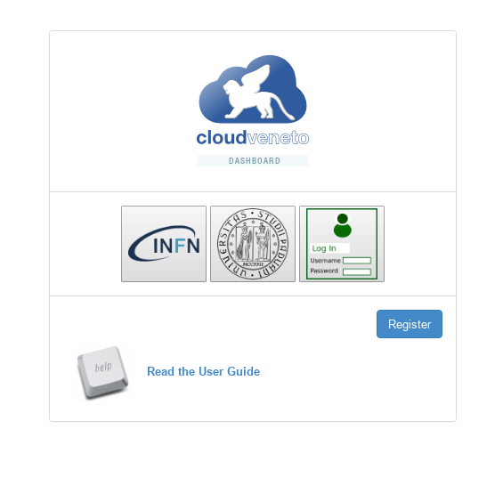
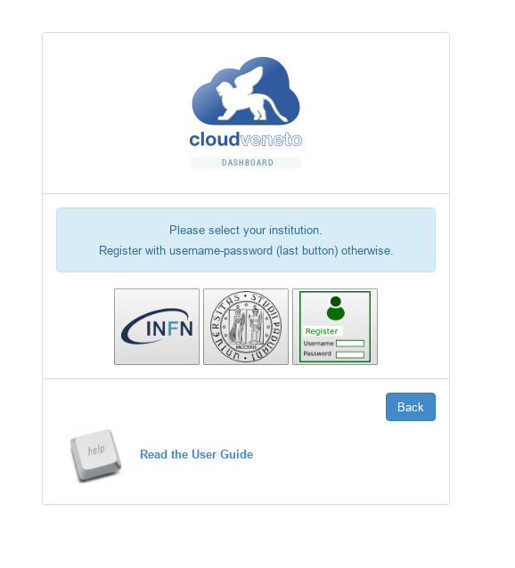
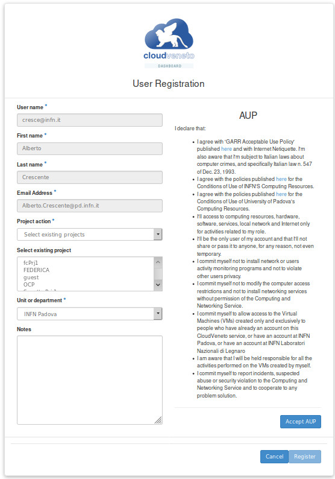
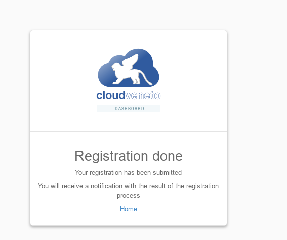
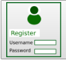
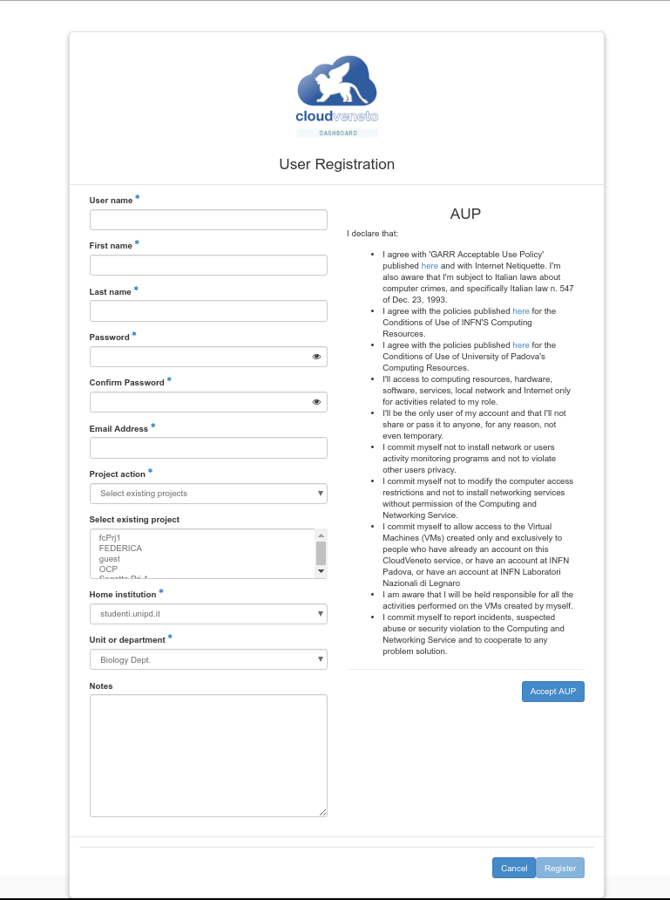
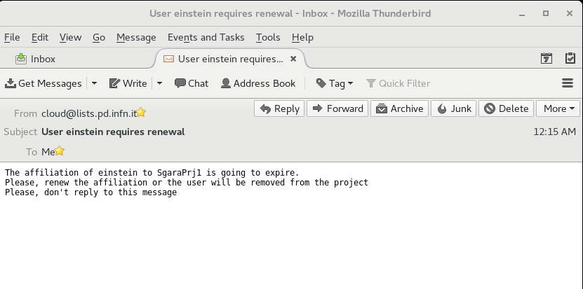

..    include:: <isonum.txt>

Registration
============

To be able to use the CloudVeneto service, first of all you need to
apply for an account. The procedure to be followed is described in this
chapter.

Apply for an account
--------------------

The registration procedure in the cloud is managed through the Horizon
Openstack web service interface.

Go to https://cloud-areapd.pd.infn.it/dashboard or
https://cloudveneto.ict.unipd.it/dashboard in a browser. The following
page should appear:

Click on the **Register** button. 

The following page should appear:

-  If you have an account on the INFN Authenticaton and
   Authorization Infrastructure (INFN AAI) and therefore you have access
   to the INFN portal, click on the INFN AAI logo and proceed with ?.

-  If you instead have an account on the UniPD Single Sign-On (SSO)
   Infrastructure (e.g. you have a username @unipd.it or
   @studenti.unipd.it), click on the UniPD logo and proceed with ?.

-  If and only if you don't have neither an account on the INFN
   Authenticaton and Authorization Infrastructure (INFN AAI) nor on the
   UniPD SSO, click on the last icon (the green one, with "Username"
   and "Password") and proceed with ?.

Enrollment procedure through INFN AAI or UniPD SSO
~~~~~~~~~~~~~~~~~~~~~~~~~~~~~~~~~~~~~~~~~~~~~~~~~~
.. TBC: Rivedere testo e figure

Once authenticated on your Identity Provider system, you will be
redirected to a form like this:

Fill the form with the required information. In particular please specify 
your home institution and the relevant unit/department.

For what concerns the **Project Action** (projects have been discussed in ?)
you have two options:

-  Select Existing Projects

-  Create new project

Choose **Select Existing Projects** if you want to apply membership for
one or more existing projects (choose them in the relevant box).

Select **Create new project** if instead you want to ask the creation of
a new project (and you are the leader of the experiment/research group
associated to this project). In this case you will have to specify also
a Project name and a Project Description. 

You will
also have to specify if this project must be private (a personal project
where you will be the only member) or not.

Newly created projects will get a default quota of:

-  20 VCPU

-  20 GB RAM

-  200 GB for Volume (e.g. non ephemeral) storage

Allocation of more resources for UniPD users must be approved by the
Cloud UniPD "governance". Mail your request to
cloud-unipd-gov@lists.pd.infn.it if you want more resources to be
allocated to your project.

.. NOTE::

    Public (i.e. not private) projects are projects where other users
    can apply for membership. They are supposed to be used for
    experiments or other research groups.

    **Personal private projects are discouraged** and are created only
    for convincing reasons.

.. NOTE::

    The person who asks for the creation of a new project is
    automatically defined as the manager of this project, i.e. he/she
    will have to manage the membership requests for this project. So the
    request to create a new project should be done by the relevant
    experiment/group leader.

When you have filled the form, please read the AUP that you need to
accept (by clicking the **Accept AUP** button).

Finally click on the **Register** button and you are done.

Your request will be managed by the Cloud adminstrator and by the
manager(s) of the project(s) for which you applied membership. You will
get an e-mail when your request is approved (and therefore you can start
using the CloudVeneto) or if for some reason your request is refused.

Apply for an account using Username and Password
~~~~~~~~~~~~~~~~~~~~~~~~~~~~~~~~~~~~~~~~~~~~
.. TBC rivedere testo e immagini

If and only if you don't have an account on the UniPD SSO or INFN AAI,
click on the green icon on the right:

A form such as the one of the
following image will appear.

Please fill the form with your personal data (First Name, Last Name, Email
Address. 
Choose a User
name (please note that it could be changed by the Cloud admins during
the registration process) and a Password. 
Specify your home institution and the relevant unit/department.

For what concerns the **Project Action** (projects have been discussed in ?)
you have two options:

-  Select Existing Projects

-  Create new project

Choose **Select Existing Projects** if you want to apply membership for
one or more existing projects (choose them in the relevant box).

Select **Create new project** if instead you want to ask the creation of
a new project (and you are the leader of the experiment/research group
associated to this project). In this case you will have to specify also
a Project name and a Project Description. 

You will
also have to specify if this project must be private (a personal project
where you will be the only member) or not.

Newly created projects will get a default quota of:

-  20 VCPU

-  20 GB RAM

-  200 GB for Volume (e.g. non ephemeral) storage

Allocation of more resources for UniPD users must be approved by the
Cloud UniPD "governance". Mail your request to
cloud-unipd-gov@lists.pd.infn.it if you want more resources to be
allocated to your project.

.. NOTE::

    Public (i.e. not private) projects are projects where other users
    can apply for membership. They are supposed to be used for
    experiments or other research groups.

    **Personal private projects are discouraged** and are created only
    for convincing reasons.

.. NOTE::

    The person who asks for the creation of a new project is
    automatically defined as the manager of this project, i.e. he/she
    will have to manage the membership requests for this project. So the
    request to create a new project should be done by the relevant
    experiment/group leader.

When you have filled the form, please read the AUP that you need to
accept (by clicking the **Accept AUP** button).

Finally click on the **Register** button and you are done.

Your request will be managed by the Cloud adminstrator and by the
manager(s) of the project(s) for which you applied membership. You will
get an e-mail when your request is approved (and therefore you can start
using the CloudVeneto) or if for some reason your request is refused.

Apply for other projects
------------------------

After you have been given an account on the CloudVeneto, at any time you
can ask the creation of a new project or the membership to an already
existing project.

Both operations are performed by accessing the 
**Identity** |rarr| **Projects** tab of
the OpenStack dashboard and clicking on **Subscribe to project** as depicted
on the following image:

.. image:: ./images/ProjectRequest.png
   :align: center

Fulfill your request selecting the relevant choice under the **Project
action** dropdown list.

Manage project membership requests (only for project managers)
--------------------------------------------------------------
.. QUI
If you are the manager of a project, you will receive membership
requests for this project that you will have to manage (approving or
refusing them).

When a user applies to be member of a project that you manage, you will
receive an e-mail such as this one:

To manage such requests, open the OpenStack web dashboard, i.e. go to
https://cloud-areapd.pd.infn.it or https://cloudveneto.ict.unipd.it in a
browser. Log in, and then access IdentitySubscriptions An image such as
the following one, with the list of the pending requests, will appear.

To approve a membership request, click on the Approve button (in
Actions). A window such as the following one will appear:

Set the expiration date of the account, and click on the Ok button to
approve the request.

If, instead, you want to reject the request, select Reject in Actions.

    **Note**

    It is therefore up to the project manager to set the expiration date
    of the members of his/her group.

    A user belonging to multiple projects can have different expiration
    dates for the different projects he/she belongs to.

Administer project members (only for project managers)
------------------------------------------------------

If you are the manager of a project, you can list the members of your
project and, if needed, change their role.

Open the OpenStack web dashboard, i.e. go to
https://cloudveneto.ict.unipd.it/dashboard in a browser. Log in using
the relevant method and access the IdentityProject Members panel. The
list of users affiliated to your project will appear:

From here you can also change the role of a specific user (by clicking
on 'Toggle Role') from 'Project User' to 'Project manager' or viceversa.

    **Note**

    If a user is promoted to Project manager, she will then be allowed
    to manage affilitation requests to the project, as described in ?.

From this window you can also remove a specific user from the project
you manage.

Manage account renewals (only for project managers)
---------------------------------------------------

When the affiliation of a user for a project is expiring, as manager of
that project you will receive an e-mail such as this one:

|email_renewreq|

To renew the affiliation for that user, open the OpenStack web
dashboard, To manage such requests, open the OpenStack web dashboard,
i.e. go to https://cloud-areapd.pd.infn.it or
https://cloudveneto.ict.unipd.it in a browser. Log in, and then access
IdentitySubscriptions. An image such as the following one will appear:

Click on the Renew button (in Actions). A window, such as the one
represented in the following image will appear:

Set the new expiration date and then click the OK button.

